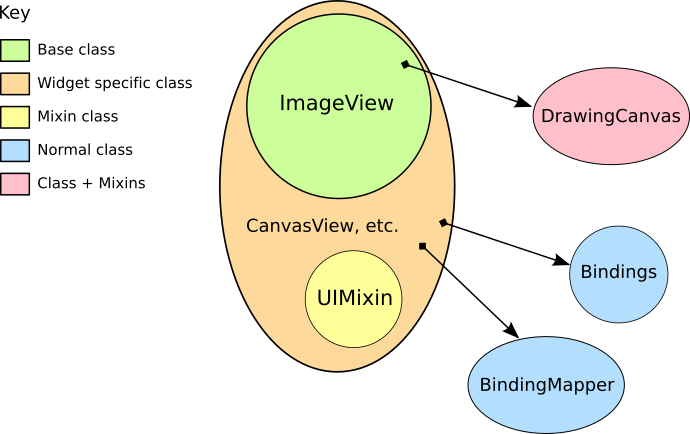

.. _ch-programming-internals:

+++++++++++++++
Ginga Internals
+++++++++++++++

This chapter explains the secret inner workings of Ginga and its classes
so that you can subclass them and use them in your own applications.

Introduction
============

Ginga uses a version of the `Model-View-Controller
design pattern <http://en.wikipedia.org/wiki/Model_view_controller>`_.
The MVC pattern spells out a division of responsibilities and
encapsulation where the Model provides various ways to access and
interface to the data, the View provides ways to display the data and
the Controller provides the methods and user interface hooks for
controlling the view.

The Model
---------

.. _fig-astroimage:
.. figure:: figures/class_structure_astroimage.png
   :scale: 100%
   :figclass: h

   Hierarchy of Ginga ``AstroImage`` class

The Model classes are rooted in the base class ``BaseImage``.  The basic
interface to the data is expected to be a Numpy-like array object that is
obtained via the ``get_data()`` method on the model.  It also provides
methods for obtaining scaled, cutouts and transformed views of the data,
and methods for getting and setting key-value like metadata.

There are two subclasses defined on BaseImage: ``RGBImage`` and
``AstroImage``.  RGBImage is used for displaying 3 channel RGB type
images such as JPEG, TIFF, PNG, etc.  AstroImage is the subclass used to
represent astronomical images and its organization is shown in
Figure :ref:`fig-astroimage`.  It has two delegate objects devoted to
handling World Coordinate System transformations and file IO.

New models can be created, subclassing from BaseImage or AstroImage.
As long as the model
`duck types <http://en.wikipedia.org/wiki/Duck_typing>`_ like a BaseImage
it can be loaded into a view object with the ``set_image()`` method.
AstroImage provides a few convenience methods for accessing WCS information
from the attached "wcs" attribute.

The View
--------

.. _fig-imageviewer:

   Class structure of Ginga basic widget viewer

Figure :ref:`fig-imageviewer` shows the class inheritance of the
``CanvasView`` class, which is the prototypical viewer class to use in a
program.
The viewer is rooted in the base class ``ImageViewBase``, which
contains the settings that control the view, such as scale (zoom),
pan position, rotation, transformation, etc along with a large number of
methods to manipulate the viewer.
Ginga supports "backends" for different widget sets (Qt, Gtk, Tk,
etc.) through various subclasses of this base class, which provide an
native window or canvas widget that can be painted with the resulting
RGB[A] image produced by a renderer.  A ``CanvasView`` viewer can be
created for any supported back end.

Every viewer has a dedicated renderer as a delegate object.
Renderers are also arranged in a hierarchical class structure.
The base renderer class is ``RenderBase``, which specifies an abstract
base class that should be implemented to render a Ginga canvas onto a
back end-specific viewer.

The Controller
--------------

The control interface is a combination of methods on the view object and
a pluggable ``Bindings`` class which handles the mapping of user input
events such as mouse, gesture and keystrokes into methods in the viewer.
There are many callback functions that can be registered,
allowing the user to create their own custom user interface for
manipulating the view.

``CanvasView`` connects various user interface events (mouse/cursor,
keystrokes, etc.) with methods in the ``BindingMapper`` and ``Bindings``
delegate objects to implement most of the user event handling logic.
With this layered class construction combined with appropriate delegate
objects, it is possible to minimize the widget specific code and reuse a
large amount of code across widget sets and platforms.
This architecture makes it a fairly simple process to port the basic Ginga
functionality to a new widget set.  All that is required is that the new
widget set have some kind of native widget that supports painting an RGB
image (like a canvas or image widget) and a way to register for user
interaction events on that widget.

Graphics on Ginga
=================

.. _fig-drawingcanvas:
.. figure:: figures/class_structure_drawingcanvas.png
   :scale: 100%
   :figclass: h

   Class structure of Ginga ``DrawingCanvas`` class.

Ginga's graphics are all rendered from objects placed on a Ginga canvas,
including images.
A Ginga canvas is a bit different from other types of canvases used in
other graphics programs. For one thing, it has no inherent color or
scale in any type of unit; it acts as a container for other graphics
objects that are stacked in a particular order.  A canvas itself is an
object that can be placed on a canvas and so it is quite straightforward
to have canvases nested in canvases or several canvases stacked together
on one canvas, etc.
The type of canvas that you will see used most frequently (primarily for
its flexibility) is the ``DrawingCanvas``, so named because it not only
allows all the typical objects to be placed on it, but it also has
methods that allow the user to draw or edit objects interactively on it.
The relationship of a viewer to a canvas is that the viewer displays
a canvas with a certain scale, rotation, transformations, color-mapping,
pan position, etc.  A canvas might be shared with another viewer which
has different settings for those things.

All objects that can be drawn by Ginga (e.g. placed in a canvas) are
decended from the ``CanvasObjectBase`` type, and made by using
subclasses or composing with mixin classes to derive new object types.
We will use the general term "Ginga canvas objects" to describe these
various entities.
In Figure :ref:`fig-drawingcanvas` we can see that a ``DrawingCanvas``
is a composite of a ``UIMixin`` (user-interface mixin), a
``DrawingMixin`` and a ``Canvas``.  A ``Canvas`` in turn is a composite
of a ``CanvasMixin`` and a ``CompoundObject``. A ``CompoundObject``
is a composite of a ``CompoundMixin`` and a ``CanvasObjectBase``.

Other Ginga canvas objects have a simpler pedigree. For example, a
``Box`` is a composite of a ``OnePointTwoRadiusMixin`` and a
``CanvasObjectBase``--so is an ``Ellipse``.  The use of these mixin
classes allows common functionality and attributes to be shared where
the similarities allow.

For more information on canvases and canvas objects, refer to
Chapter:ref:`_ch-canvas_graphics`.

Miscellaneous Topics
====================

.. _sec-custom-wcs:

I want to use my own World Coordinate System!
---------------------------------------------

No problem.  Ginga encapsulates the WCS behind a pluggable object used
in the AstroImage class.  Your WCS should implement this abstract class:

.. code-block:: python

    def MyWCS(object):
        def __init__(self, logger):
            self.logger = logger

        def get_keyword(self, key):
            return self.header[key]

        def get_keywords(self, *args):
            return [self.header[key] for key in args]

        def load_header(self, header, fobj=None):
            pass

        def pixtoradec(self, idxs, coords='data'):
            # calculate ra_deg, dec_deg
            return (ra_deg, dec_deg)

        def radectopix(self, ra_deg, dec_deg, coords='data', naxispath=None):
            # calculate x, y
            return (x, y)

        def pixtosystem(self, idxs, system=None, coords='data'):
            return (deg1, deg2)

        def datapt_to_wcspt(self, datapt, coords='data', naxispath=None):
            return [[ra_deg_0, dec_deg_0], [ra_deg_1, dec_deg_1], ...,
                    [ra_deg_n, dec_deg_n]]

        def wcspt_to_datapt(self, wcspt, coords='data', naxispath=None):
            return [[x0, y0], [x1, y1], ..., [xn, yn]]

To use your WCS with Ginga create your images like this:

.. code-block:: python

    from ginga.AstroImage import AstroImage
    AstroImage.set_wcsClass(MyWCS)
    ...

    image = AstroImage()
    ...
    view.set_image(image)

or you can override the WCS on a case-by-case basis:

.. code-block:: python

    from ginga.AstroImage import AstroImage
    ...

    image = AstroImage(wcsclass=MyWCS)
    ...
    view.set_image(image)

You could also subclass AstroImage or BaseImage and implement your own
WCS handling.  There are certain methods in AstroImage used for graphics
plotting and plugins, however, so these would need to be supported if
you expect the same functionality.

.. _sec-custom-io:

I want to use my own file storage format, not FITS!
---------------------------------------------------

First of all, you can always create an ``AstroImage`` and assign its
components for wcs and data explicitly.  Assuming you have your data
loaded into an ``numpy`` array named ``data``:

.. code-block:: python

    from ginga import AstroImage
    ...

    image = AstroImage()
    image.set_data(data)

To create a valid WCS for this image, you can set the header in the
image (this assumes ``header`` is a valid mapping of keywords to values):

.. code-block:: python

    image.update_keywords(header)

An ``AstroImage`` can then be loaded into a viewer object with
``set_dataobj()``.  If you need a custom WCS see the notes in Section
:ref:`sec-custom-wcs`.
If, however, you want to add a new type of custom loader into Ginga's
file loading framework, you can do so using the following instructions.

Adding a new kind of file opener
--------------------------------

Ginga's general file loading facility breaks the loading down into two
phases: first, the file is identified by its ``magic`` signature
(requires the optional Python module ``python-magic`` be installed) or MIME
type.  Once the general category of file is known,
methods in the specific I/O module devoted to that type are called to
load the file data.

The `ginga.util.loader` module is used to register file openers. An
opener is a class that understand how to load data objects from a
particular kind of file format.

For implementing your own special opener, take a look at the
``BaseIOHandler`` class in `ginga.util.io.io_base`. This is the base
class for all I/O openers for Ginga.  Subclass this class, and implement
all of the methods that raise ``NotImplementedError`` and optionally
implement any other methods marked with the comment "subclass should
override as needed".  You can study the `io_fits` and `io_rgb` modules
to see how these methods are implemented for specific formats.
Here is an example opener class for HDF5 standard image files:

.. literalinclude:: code/io_hdf5.py

Once you have created your opener class (e.g. ``HDF5FileHandler``), you
can register it by:

.. code-block:: python

    from ginga.util import loader
    import io_hdf5
    loader.add_opener(io_hdf5.HDF5FileHandler, ['application/x-hdf'])

If you want to use this with the Ginga reference viewer, a good place to
register the opener is in your ``ginga_config.py`` as discussed in
Section :ref:`sec-workspaceconfig` of the Reference Viewer Manual.
The best place is probably by implementing ``pre_gui_config`` and
registering it as shown above in that function.
Once your loader is registered, you will be able to drag and drop files
and use the reference viewers regular loading facilities to load your data.

Changes to Ginga API in v4.0.0
------------------------------
Prior to Ginga v4.0.0, it was possible to use a *combination* viewer and
canvas--a viewer object that acts also like a ginga canvas.  These were
accessible via the `ImageViewCanvas*` classes.

In Ginga v4.0.0 these "dual entity" classes have been removed, to
simplify the code and clearly delineate the use of each kind of object:
a viewer shows the contents of a canvas for some backend, whereas a
canvas contains the items to be viewed (and can be shared by viewers).

If you have legacy code that is making canvas API calls on the viewer,
you simply need to use the `get_canvas()` method on the viewer to get the
canvas object and then make the canvas API call on that.

Porting Ginga to a New Widget Set
---------------------------------

[*TBD*]
