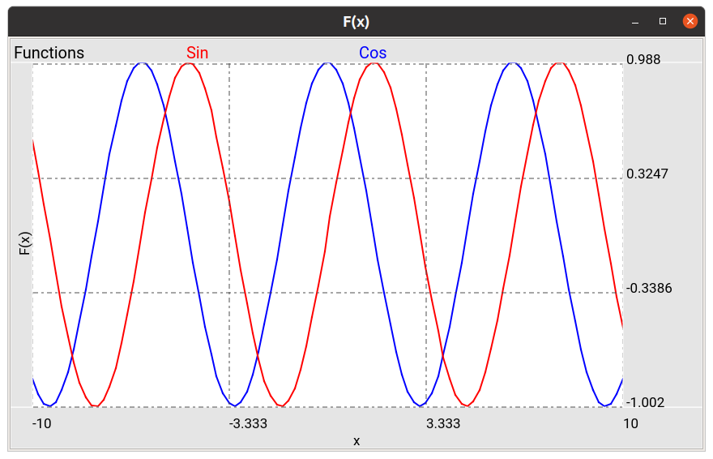
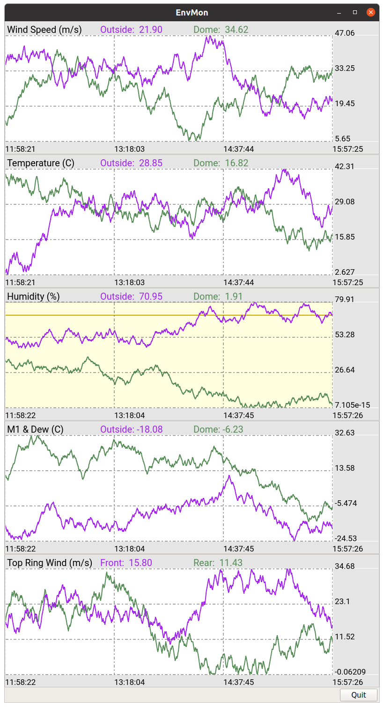

.. _ch-plots:

+++++
Plots
+++++

.. note:: Ginga's graph plotting features are new, and the API should be 
          considered somewhat experimental.  In the future, some
          elements of ``PlotAide`` might be merged into existing
          components of the viewer or action bindings classes.

Ginga has some basic facilities for graphing interactive XY line plots.
Ginga plots may be useful in cases where good interactive performance in
a line plot is desirable (e.g. plotting an XY line repeatedly at speed),
or being able to zoom in and out of X and Y axes independently, flip
axes, swap axes or pan axes independently.
There is some special support for plotting and examining time-series
data.

Graphs are shown in a Ginga viewer and managed mostly by a separate
``PlotAide`` object, which manipulates the viewer and its main canvas.
The plot aide is like a coordinator or intermediary between the
components of the plot.  It initializes the viewer for special user
plot interaction and provides some coordination between XY plots and
other "plot decor" like plot title and key, axis titles, axis grids and
markers, etc.  

============
Plot objects
============
Plot objects are available by importing classes from
``ginga.canvas.types.plots``.  These classes are divided into "plot
decor": plot title and key area (``PlotTitle``), X axis title, grid and
markers (``XAxis``), Y axis title grid and markers (``YAxis``), plot
background (``PlotBG``), etc. ``XYPlot`` objects (or subclasses
thereof) form the individual plot lines within the graph.
In typical use, the plot aide provides a convenience method
(``setup_standard_frame``) that can automatically add and configure the
plot decor, so that the user then simply needs to instantiate
``XYPlot`` objects and add them to the plot via the plot aide's
``add_plot`` method.

Assuming that we have created and configured a ``CanvasView`` viewer
(``v``) with an associated ``ScrolledView`` widget (``sw``), we can
setup an empty graph (refer to
:ref:`ch-developing_with_the_ginga_view_class` for a review of creating
a viewer and associated scroll widget): 

.. code-block:: python

    from ginga.plot.PlotAide import PlotAide

    aide = PlotAide(v)
    aide.configure_scrollbars(sw)

    aide.setup_standard_frame(title="Functions", x_title="x", y_title="f(x)")

    
To plot, simply call ``plot`` or ``plot_xy`` (depending on whether your
data points are together or in separate arrays) on each ``XYPlot``
object that is present in the graph.  Then call ``update_plots()`` on
the plot aide to update the viewer.  

Let's add two plots to this interactive graph:

.. code-block:: python

    from ginga.canvas.types.plots import XYPlot
    import numpy as np
    
    sin_plot = XYPlot(name='Sin', color='red', linewidth=2.0)
    aide.add_plot(sin_plot)
    
    cos_plot = XYPlot(name='Cos', color='blue', linewidth=2.0)
    aide.add_plot(cos_plot)

Finally, let's assign some data to the plots and update the viewer:

.. code-block:: python

    x_arr = np.linspace(-10.0, 10.0, 100)
    y_arr = np.sin(x_arr)
    sin_plot.plot_xy(x_arr, y_arr)

    y_arr = np.cos(x_arr)
    cos_plot.plot_xy(x_arr, y_arr)

    aide.update_plots()

    
.. _plots_fig1:

   The plotted Sine and Cosine curves.

Support for autoscaling axes
============================
The plot aide has two settings that control auto adjustment of the
viewer's scale and pan positions when the view is updated (via
``update_plots``).  The settings are intrinsic to the plot aide.
The values can be toggled by keystroke commands within the viewer, or
programatically by assigning the appropriate settings on the plot aide:

.. code-block:: python

    aide.settings.set(autoaxis_x='off', autoaxis_y='vis')

autoaxis_x
----------

The setting for `autoaxis_x` controls how the viewer will handle the X
dimension as far as panning and scaling automatically when the view is
updated. The settings are:

* `off`: the viewer makes no pan or scale adjustments to X
* `pan`: the viewer pans so that the values at the end of the plot are
  visible; this is useful for live time-series plots, for example
* `on`: the viewer scales and pans so that the full X plot can be fit
  to the plot area shown in the viewer

The default value in the plot aide is `on`.  

autoaxis_y
----------

The setting for `autoaxis_y` controls how the viewer will handle the Y
dimension as far as panning and scaling automatically when the view is
updated. The settings are:

* `off`: the viewer makes no pan or scale adjustments to Y
* `vis`: the viewer scales Y so that the Y values corresponding to the X
  values visible in the plot will fill the Y dimension of the plot area
* `on`: the viewer scales and pans so that the full Y range of the data
  (visible or not) could be shown in the plot area of the viewer
  
The default value in the plot aide is `on`.

=======================================
Interactive Viewer Operations on Graphs
=======================================

For default bindings for interactive graph operations, see the "Plot"
mode in the Ginga Quick Reference (:ref:`plot_mode`).  The plot aide
will initialize the viewer into Plot mode, so that it is continually
ready for user interaction with the graph.

Zooming Graphs
==============

Zooming on graphs is handled independently in the X and Y axes.
Mouse or touchpad scrolling is usually used to zoom the X axes.
Note that zooming will normally change any autoaxis setting to `off`
since you are overriding the setting.
See the Quick Reference link above for the cursor and key commands
in plot mode for zooming and changing the autoaxis settings
interactively.

Panning Graphs
==============

Panning graphs is usually accomplished via scroll bars.
When used with a properly configured scroll widget (as shown in the
example above), the scrollbar aligned with the X axis becomes visible
when `autoaxis_x` becomes `off`.
Similarly, the scrollbar aligned with the Y axis becomes visible when
`autoaxis_y` becomes `off`.  The scroll bars can then be used
independently to pan the graph in either axis.

Flipping and swapping
=====================

You can flip the X or Y axis and also swap axes, if it makes sense to do
so.  The usual key bindings for these can be found in the Ginga quick
reference under the Transform commands (:ref:`transform_commands`). 

=================
Time Series Plots
=================

Time-series plots are plots in which time is plotted on the X axis.
Ginga has some special support for these in the module
`ginga.plot.time_series`.  There are classes for ``XTimeAxis``,
``TimePlotTitle``, ``TimePlotBG`` that can be used in place of the
normal plot decor, and an ``XYDataSource`` that can be used to
efficiently keep track of a large fixed array of (x, y) points, from
which a ``XYPlot`` can be conveniently updated.
When using custom plot decor like this, you need to add it manually via
the plot aide's ``add_plot_decor`` method, instead of using
``setup_standard_frame``: 

.. code-block:: python

    import ginga.plot.time_series as tsp
    from ginga.canvas.types.plots import YAxis

    # our plot
    aide = PlotAide(viewer)
    aide.settings.set(autoaxis_x='pan', autoaxis_y='vis')

    bg = tsp.TimePlotBG(warn_y=70.0, alert_y=80.0, linewidth=2)
    aide.add_plot_decor(bg)

    title = tsp.TimePlotTitle(title="Humidity (%)")
    aide.add_plot_decor(title)

    x_axis = tsp.XTimeAxis(num_labels=4)
    aide.add_plot_decor(x_axis)

    y_axis = YAxis(num_labels=4)
    aide.add_plot_decor(y_axis)

The ``TimePlotBG`` class has support for a `warning` and an `alert`.
These are set when the current (last or right-most) Y value exceeds the
``warn_y`` or ``alert_y`` values.
In the above example, the warning value is set to 70.0 and the alert
value is set to 80.0.  The warning and alert levels, if set, are shown
by yellow and red lines in the plot background. Additionally, if the
current Y value exceeds the warning level then the background turns
yellow, as shown in the example application below; if it exceeds the
alert level then the background turns pink (alert takes precedence over
warning).  If either ``warn_y`` or ``alert_y`` values are not passed, or
set to ``None``, then there will be no warning or alert lines or
background color change in the plot.

For more detail on time series plots, see the example
"plot_time_series.py" under the "examples/gw" folder.

.. _plots_fig2:

   An example of time series plots with fake environment data.  Each
   plot contains 86400 seconds (24 hours) of data points, and can be
   zoomed and panned interactively using the methods described in the
   Quick Reference link above.

