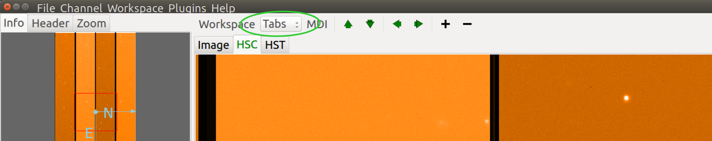
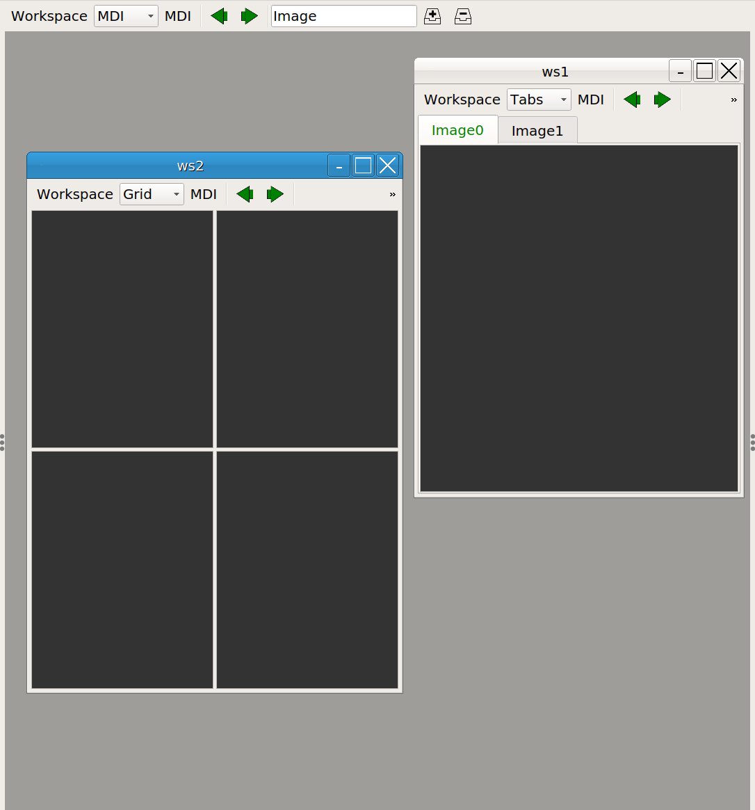
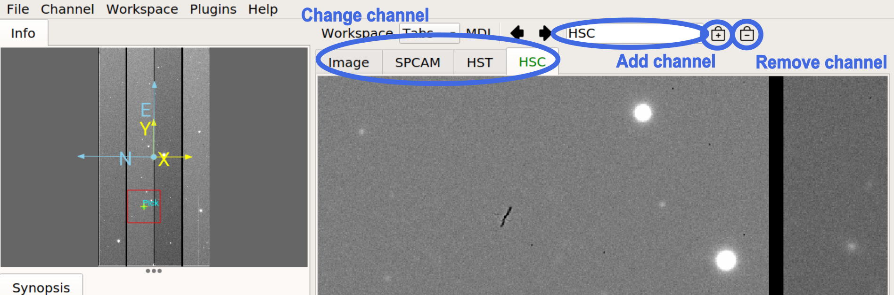
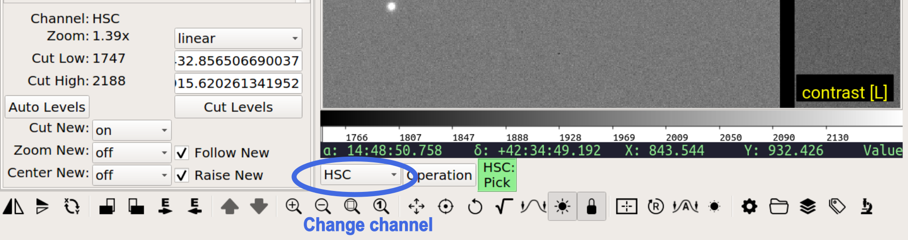
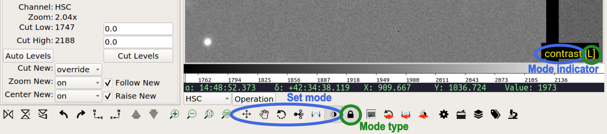

.. _ch-core-concepts:

+++++++++++++
Core Concepts
+++++++++++++

The Ginga reference viewer operation is organized around several basic concepts: *workspaces*, *channels*, *plugins*, *modes*.
Understanding these will greatly aid in using and modifying Ginga.

----

.. _concepts-workspaces:

==========
Workspaces
==========

Ginga has a flexible workspace layout algorithm that allows customizing the appearance of the program. The majority
of the Ginga interface is constructed as hierarchical series of horizontally or
vertically-adjustable panels. Each panel is eventually a
*workspace*.
Each workspace is implemented by a GUI toolkit container widget such as
a notebook widget, where each item in the workspace is identified by a
tab. 

However, workspaces can also take the form of a stack (like a tabbed
widget but with no tabs showing), or a Multiple Document Interface (MDI)
style container (subwindow desktop-style layout), or a grid layout.

Workspaces typically contain either a channel *viewer*, a *plugin* UI or
another workspace. 
In its default configuration, Ginga starts up with a
single row (horizontal) panel of three workspaces, as shown in
the image below.

.. image:: figures/gingadefault.png
   :width: 1024px
   :align: center

The panel is sandwiched vertically between a menu bar and a status bar.
The left workspace is further subdivided into an upper and lower, and
there are also thin horizontal workspaces below the central workspace.
The central workspace is mainly used for viewers, while the other
workspaces hold the plugin UIs.

The initial layout of the workspaces is controlled by a 
table in the Ginga startup script (see :ref:`ch-customization`).
By changing this table the layout can be substantially altered. 

.. note:: 
   
   Note that workspaces may be implemented by several types of container widgets such as fixed position subwindows, sliding panes, MDI-style subwindows, etc.  

   A notebook widget is simply the most common (default) case.

Some workspaces can be converted dynamically between the different types. 
If the workspace contains a *workspace toolbar*, the workspace type
selector can be used to change the type: 

In the example shown below, we show a cutout of the main workspace
(tabbed), which has two tabs: a channel viewer (*Image*) and a second workspace (*ws1*).

The *ws1* workspace is configured as type *MDI* and
has two windows: a viewer (*Image0*) and a third workspace (*ws2*). The
third workspace contains a grid of four viewers. 
Depending on the the support of the back end widget set, tabs can be
dragged between workspaces (or out onto the desktop if you are
using the Gtk widget set), forming a new, detached workspace.

----

.. _concepts-channels:

========
Channels
========

Another core tenet of Ginga is that that image content is organized
into *channels*.  A channel can be thought of as simply a named
category under which similar types of images might be organized. A few examples are: 

* A channel for each type of instrument at a telescope
* A channel for each observation or calibration target
* Channels based on time or program or proposal identifier

If no channels are specified when Ginga starts up it simply creates a
default channel named *Image*. New channels can be created using the
*Channel/Add channel* menu item. Pressing the ``+`` button in the
workspace menu also adds a new channel using a default name.

A channel always has an image viewer associated with it, and may
additionally have a table viewer. The viewer is what you see in the active window representing that channel.

In the workspace toolbar, pressing ``-`` removes the currently selected
channel, while pressing the up or down arrows moves between images
in the selected channel. 

In the case where multiple channels are present, they are usually visually
organized as tabs, windows, and grid within the central workspace of the
interface (as shown in the figure above) depending on how the workspace
is configured.
To change channels you simply click on the tab of the channel you want to
view, or press the left or right arrow buttons in the workspace menu.
There is also a channel selector in the plugin manager toolbar at
the bottom of the center pane. You can change the channel by using the drop-down menu or by simply
scrolling the mouse wheel on the control.

Channels occupy a flat namespace, i.e., there is no hierarchy
in channel names.

By default, images are loaded into the same channel you are currently
viewing (unless your viewer has been customized to load images according to special rules).

.. note::

   To keep images organized, simply change to the desired channel before opening a new image, or drag the image to the desired channel viewer.

Many preferences in Ginga are set on a per-channel basis.
Some per-channel settings include:

* Color distribution algorithm
* Color map
* Intensity map
* Cut levels
* Auto cut levels algorihm
* Transforms (flip, swap)
* Rotation
* WCS display coordinates
* Zoom algorithm
* Scale
* Interpolation type
* Pan position

A new channel will generally inherit the settings for the generic *Image* channel until new preferences are defined and saved. 

If you create a new channel and had previously saved preferences for a channel with that name, the new channel will adopt those preferences. 
Thus you can set up channels configured for certain telescopes or for types of data and easily reuse them in later sessions.

Another idea embodied in the channel concept is that the user should not have to manage memory usage too explicitly.  Each channel has a setting that limits how many images it should keep in memory. If the number of images 
exceeds the limit then Ginga will remove older images and load them back in as needed without user intervention.

----

.. _concepts_plugins:

=======
Plugins
=======

Almost all functionality in Ginga is achieved through the use of a plugin
architecture.  

Plugins are quasi-independent Python modules that can
optionally have a Graphical User Interface. If they do have a GUI, it can be loaded at program startup or be dynamically opened and closed during the duration of the viewer's execution.  

Plugins can be *global*, in which case they don't have any particular affiliation with a channel and
are generally invoked singularly, or *local* in which case they can be invoked in multiple instances--one per channel.

In this documentation we will also use the word *operation* to describe activating a plugin. For example, a "pick" operation would use the Pick
plugin. 

Plugins are written as encapsulated Python modules
that are loaded dynamically when Ginga starts. There is an API for programming plugins (see :ref:`ch-programming-ginga`).

The plugins are each described in more detail in  
:ref:`ch-plugins`.    

For those plugins that do have a visible interface, the Ginga startup script can map them to certain workspaces. By manipulating this mapping (and manipulating the workspace layout) we can customize to achieve flexible layouts.  

In the image at the top, the left workspace contains three
global plugin UIs: the Info, Header and Zoom panes.  The middle workspace
holds all the viewing panes for each channel.  The right workspace has
the Dialogs, Thumbs, Contents and Error panes.  The operation of these
plugins is described in :ref:`ch-plugins`. 

----

.. _concepts-modes:

=====
Modes
=====

Ginga provides a number of default bindings for key and pointer actions.
However, there are too many different actions to bind to a limited set of keys and pointer buttons.
*Modes* allow us to overcome this limitation. 

*Modes* are a mechanism that allow Ginga to accommodate many key and pointer bindings for a large number of operations. 

Modes are set on a per-channel basis. Pressing a particular
mode key in a channel viewer puts that viewer into that mode. 

When in a mode, the behavior is that *some* special key, and the cursor and scroll bindings will override the default ones. 
An adjacent viewer for a different channel may be in a different mode, or no mode.

.. note::

   If a mode does not override a particular binding, the default one will still be active.  

Modes have an associated *mode type* which can be set to one of:

* ``held``: The mode is active while the activating key is held down
* ``oneshot``: The mode is released by initiating and finishing a cursor drag,
  or when `Esc` is pressed, if no cursor drag is performed
* ``locked``: The mode is locked until the mode key is pressed again (or `Esc`)
* ``softlock``: The mode is locked until another mode key is pressed (or `Esc`)

By default most modes are activated in "oneshot" type, unless the mode
lock is toggled.  The mode lock is typically toggled in and out of
softlock by the ``l`` (lowercase letter l) key and "locked" with ``L``.

Modes are usually indicated by a small black rectangle with the mode name in one corner of the viewer, usually in the lower right corner of the viewer.

.. note::

   When the lock is active it is signified by an additional "[SL]" (softlock) or "[L]" (locked) appearing in the mode indicator.

In the above figure, you can see the mode indicator showing that
the viewer is in "contrast" mode, with the softlock on. The same
information can be seen in the Toolbar plugin. On the Toolbar plugin
you can click to set the mode and toggle the lock on/off.

