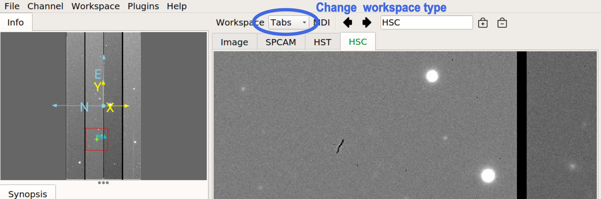

.. _ch-core-concepts:

+++++++++++++
Core Concepts
+++++++++++++

The Ginga reference viewer operation is organized around several basic
concepts: *workspaces*, *channels*, *plugins*, and *modes*.
Understanding these will greatly aid in using and modifying Ginga.

----

.. _concepts-workspaces:

==========
Workspaces
==========

Ginga has a flexible workspace layout algorithm that allows customizing
the appearance of the program. The majority of the Ginga interface is
constructed as hierarchical series of horizontally or
vertically-adjustable panels. Each panel usually terminates eventually
into one or more *workspaces*.

Each workspace is implemented by a GUI toolkit container widget such as
a notebook widget, where each item in the workspace is identified by a
tab.  However, workspaces can also take the form of a stack (like a
tabbed widget but with no tabs showing), or a Multiple Document
Interface (MDI) style container (subwindow desktop-style layout), or a
grid layout. 

Workspaces typically contain either a channel *viewer*, a *plugin* UI or
another workspace. 
In its default configuration, Ginga starts up with a
single row (horizontal) panel of three workspaces, as shown in
the image below.

.. image:: figures/gingadefault.png
   :width: 1024px
   :align: center

The panel is sandwiched vertically between a menu bar and a tool bar.
The left workspace is further subdivided into an upper and lower, and
there are also thin horizontal workspaces below the central workspace.
The central workspace is mainly used for viewers, while the other
workspaces hold the plugin UIs.

Some workspaces can be converted dynamically between the different types. 
If the workspace contains a *workspace toolbar*, the workspace type
selector can be used to change the type: 

The main workspace configured as "Tabs" (tabbed notebook, the default):

.. image:: figures/ginga_ws_tabs.png
   :width: 800px
   :align: center

The main workspace configured as "Grid":

.. image:: figures/ginga_ws_grid.png
   :width: 800px
   :align: center

The main workspace configured as "Stack" (need to use workspace toolbar
left/right arrows to switch between subwindows):

.. image:: figures/ginga_ws_stack.png
   :width: 800px
   :align: center

The main workspace configured as "MDI" (individual windows can be sized
and moved around the workspace area):

.. image:: figures/ginga_ws_mdi.png
   :width: 800px
   :align: center

In the MDI configuration, the "MDI" menu in the workspace toolbar
is enabled and can be used to tile or cascade the subwindows.

Workspaces can be nested.  In the example shown below, we show a cutout
of the main workspace (type "MDI") which has sub-workspaces: *ws1*, 
configured as type *Tabs* and has two channels, and *ws2*, configured as
type "Grid" and containing four channels.

.. image:: figures/nested_workspaces.png
   :width: 1024px
   :align: center

The initial layout of the workspaces is controlled by a 
table in the Ginga startup script (see :ref:`ch-customization`).
By changing this table the layout can be substantially altered. 

----

.. _concepts-channels:

========
Channels
========

Another core tenet of Ginga is that that data content is organized
into *channels*.  A channel can be thought of as simply a named
category under which similar types of data might be organized. A few
examples are:  

* A channel for each type of instrument at a telescope
* A channel for each observation or calibration target
* Channels based on time or program or proposal identifier

If no channels are specified when Ginga starts up it simply creates a
default channel named *Image*. New channels can be created using the
*Channel/Add channel* menu item. Pressing the ``+`` button in the
workspace menu also adds a new channel using the name specified in the
text box just to the left of the button, or using a default prefix, if
no name is specified.  Clicking ``-`` removes the currently selected
channel.  Clicking the left or right arrow buttons changes which
channel is selected in the workspace.

In the case where multiple channels are present, they are usually visually
organized as tabs, a stack of windows, a grid, or an MDI interface
within the workspace as described in the section above, depending on how
the workspace is configured.

.. image:: figures/channels.png
   :width: 800px
   :align: center

To change channels you simply click on the tab of the channel you want to
view, or press the left or right arrow buttons in the workspace menu.
There is also a channel selector in the plugin manager toolbar at
the bottom of the center pane. You can change the channel by using the
drop-down menu or by simply scrolling the mouse wheel on the control.

.. image:: figures/channel_selector.png
   :width: 800px
   :align: center

Channels occupy a flat namespace, i.e., there is no hierarchy in channel
names.

Channel Viewers
---------------

A channel always has an image viewer associated with it, and may
additionally have viewers for tables or other content. Only one viewer
is active at a time per channel.  The channel viewer is what you see in
the window representing that channel. 
The viewer will display the content of the currently selected data
item in that channel, and the appropriate viewer will be change according
to the type of the currently selected item in the channel (e.g. the
table viewer will be activated when a table is selected, the image
viewer when an image is selected and so on).

In the Toolbar plugin, just above the status bar near the bottom of
the window, clicking the up or down arrows moves between items within the
selected channel. The ordering of the items in the channel is by default
determined by the order in which they were added, but can be changed to
alphanumeric sorted ordering if desired (this is a channel preference
that can be set under the "General" category in the channel preferences).

           
By default, images are loaded into the same channel you are currently
viewing (unless your viewer has been customized to load images according
to special rules). 

.. note::

   To keep items organized, simply change to the desired channel before
   opening a new item or drag the file to the desired channel viewer. 

Channel Settings
----------------

Many preferences in Ginga are set on a per-channel basis.
Some per-channel settings include:

* Color distribution algorithm
* Color map
* Intensity map
* Cut levels
* Auto cut levels algorithm
* Transforms (flip, swap)
* Rotation
* WCS display coordinates
* Zoom algorithm
* Scale
* Interpolation type
* Pan position

A new channel will generally inherit the settings for the generic
*Image* channel until new preferences are defined and saved for that channel.  

If you create a new channel and had previously saved preferences for a
channel with that name, the new channel will adopt those preferences.  
Thus you can set up channels configured for certain telescopes or for
types of data and easily reuse them in later sessions. 

Another idea embodied in the channel concept is that the user should not
have to manage memory usage too explicitly.  Each channel has a setting
that limits how many images it should keep in memory. If the number of
images exceeds the limit then Ginga will remove older images and load
them back in as needed without user intervention.

.. note:: 
   
   Many channel settings can be set and saved using the "Preferences" plugin.

----

.. _concepts_plugins:

=======
Plugins
=======

Almost all functionality in Ginga is achieved through the use of a plugin
architecture.  

Plugins are quasi-independent Python modules that can optionally have a
Graphical User Interface. If they do have a GUI, it can be loaded at
program startup or be dynamically opened and closed during the duration
of the viewer's execution.   

Plugins can be *global*, in which case they don't have any particular
affiliation with a channel and are generally invoked singularly, or
*local* in which case they can be invoked in multiple instances--one per
channel. Global plugins are often written in a way that they respond to
the action of the user changing channels. As an example, the "Pan"
plugin will change its image to match the image shown in the selected
channel.

In this documentation we will also use the word *operation* to describe
activating a plugin. For example, a "pick" operation would use the Pick 
plugin. 

Plugins are written as encapsulated Python modules that are loaded
dynamically when Ginga starts. There is an API for programming plugins
(see :ref:`ch-programming-ginga`). 

The plugins are each described in more detail in  
:ref:`ch-plugins`.    

For those plugins that do have a visible interface, the Ginga startup
script can map them to certain workspaces. By manipulating this mapping
(and manipulating the workspace layout) we can customize the reference
viewer to achieve flexible layouts.   

In the image at the top, the left workspace contains UIs for two global
plugins: *Pan* (shown under the tab "Info") and *Info* (somewhat
confusingly, shown under the tab "Synopsis"--the tab name for a plugin
can be different from it's canonical name).  The middle workspace
holds all the viewing panes for each channel.  The right workspace has
the Dialogs, Thumbs, Contents and Error panes.  The operation of these
plugins is described in :ref:`ch-plugins`. 

----

.. _concepts-modes:

=====
Modes
=====

Ginga provides a number of default bindings for key and pointer actions.
However, there are too many different actions to bind to a limited set
of keys and pointer buttons. *Modes* allow us to overcome this limitation. 

*Modes* are a mechanism that allow Ginga to accommodate many key and
pointer bindings for a large number of possible operations.  

Modes are set on a per-channel basis. A mode is activated by pressing a
particular key combination when the focus is in the viewer, or by
clicking an appropriate button in the Toolbar plugin. 
When the viewer is in a mode, the behavior is that some special key,
pointer and scroll bindings will be activated and override the default ones.  
An adjacent viewer for a different channel may be in a different mode,
or no mode. 

.. note::

   If a mode does not override a particular binding, the default binding
   will still be active, unless an active canvas being shown in the
   viewer has registered for the same binding.   

