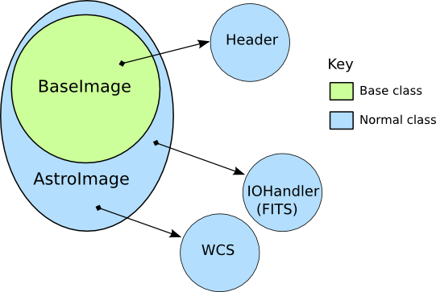
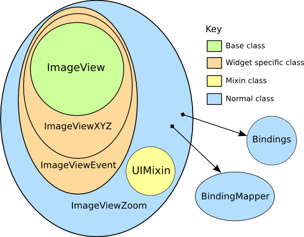
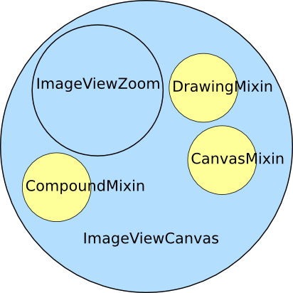

.. _ch-programming-internals:

+++++++++++++++
Ginga Internals
+++++++++++++++

This chapter explains the secret inner workings of Ginga and its classes
so that you can subclass them and use them in your own applications.

Introduction
============

Ginga uses a version of the `Model-View-Controller
design pattern <http://en.wikipedia.org/wiki/Model_view_controller>`_.
The MVC pattern spells out a division of responsibilities and
encapsulation where the Model provides various ways to access and
interface to the data, the View provides ways to display the data and
the Controller provides the methods and user interface hooks for
controlling the view. 

The Model
---------

.. _fig-astroimage:

   Hierarchy of Ginga ``AstroImage`` class 

The Model classes are rooted in the base class ``BaseImage``.  The basic
interface to the data is expected to be a Numpy-like array object that is
obtained via the ``get_data()`` method on the model.  It also provides
methods for obtaining scaled, cutouts and transformed views of the data,
and methods for getting and setting key-value like metadata.

There are two subclasses defined on BaseImage: ``RGBImage`` and
``AstroImage``.  RGBImage is used for displaying 3 channel RGB type
images such as JPEG, TIFF, PNG, etc.  AstroImage is the subclass used to 
represent astronomical images and its organization is shown in
Figure :ref:`fig-astroimage`.  It has two delegate objects devoted to
handling World Coordinate System transformations and file IO.
There is also a mixin class, ``LayerImage`` that can be used to create
layered images with alpha compositing on each layer.

New models can be created, subclassing from BaseImage or AstroImage.
As long as the model
`duck types <http://en.wikipedia.org/wiki/Duck_typing>`_ like a BaseImage
it can be loaded into a view object with the ``set_image()`` method.
AstroImage provides convenience methods for accessing WCS information
that may be necessary when using the model in canvas subclasses of a
View that allow graphics drawing. 

The View
--------

.. _fig-imageviewzoom:

   Class hierarchy of Ginga ``ImageViewZoom`` class 

Figure :ref:`fig-imageviewzoom` shows the class inheritance of the
ImageViewZoom class, which is a typical end class to use in a program if
one is not planning to do any graphical overplotting.  The figure key
indicates the base class verses the widget specific classes.

The View classes are rooted in the base class ``ImageView``, which
handles image display, scaling (zooming), panning, manual cut levels,
auto cut levels, color mapping, transformations, and rotation.
The ImageView is quite powerful compared to base classes in most
inheritance designs, as it actually renders the view all the way out to
RGB image planes in the appropriate sizes for the widget target window.
Ginga supports "backends" for different widget sets (Gtk, Qt, Tk,
etc.) through various subclasses of this base class, which do the actual
painting of the resulting RGB image into a widget in the native widget set.

In this example, ``ImageViewXYZ`` is a class that renders to a native
widget in the "XYZ" toolkit.  ``ImageViewEvent`` adds event handlers for
various pointing and keyboard events, but without connecting them to any
particular handling scheme.  Finally, ``ImageViewZoom`` provides a
concrete implementation of event handling by connecting the handlers in
the ImageViewEvent class with the logic in the ``BindingMapper`` and
``Bindings`` delegate objects as will as some logic in the ``UIMixin``
class.  This event handling scheme is described in more detail in the
section on the Controller.  With this layered class construction, it is
possible to minimize the widget specific code and reuse a large amount
of code across widget sets and platforms.
Because the vast majority of work is done in the base class, and the
outer classes simply inherit the widget-specific ones and mix in the
others, it is a fairly simple matter to port the basic Ginga
functionality to a new widget set.  All that is required is that the new
widget set have some kind of native widget that supports painting an RGB
image (like a canvas or image widget) and a way to register for user
interaction events on that widget.

The Controller
--------------

The control interface is a combination of methods on the view object and
a pluggable ``Bindings`` class which handles the mapping of user input
events such as mouse, gesture and keystrokes into commands on the view.
There are many callback functions that can be registered,
allowing the user to create their own custom user interface for
manipulating the view.

Graphics on Ginga
=================

.. _fig_imageviewcanvas:

   Class construction of Ginga ``ImageViewCanvas`` class. 

Miscellaneous Topics
====================

.. _sec-custom-wcs:

I want to use my own World Coordinate System!
---------------------------------------------

No problem.  Ginga encapsulates the WCS behind a pluggable object used
in the AstroImage class.  Your WCS should implement this abstract class:

.. code-block:: python

    def MyWCS(object):
        def __init__(self, logger):
            self.logger = logger
           
        def get_keyword(self, key):
            return self.header[key]
        
        def get_keywords(self, *args):
            return map(lambda key: self.header[key], args)
        
        def load_header(self, header, fobj=None):
            pass
    
        def pixtoradec(self, idxs, coords='data'):
            # calculate ra_deg, dec_deg
            return (ra_deg, dec_deg)
        
        def radectopix(self, ra_deg, dec_deg, coords='data', naxispath=None):
            # calculate x, y
            return (x, y)
    
        def pixtosystem(self, idxs, system=None, coords='data'):
            return (deg1, deg2)
    

To use your WCS with Ginga create your images like this:

.. code-block:: python

    from ginga.AstroImage import AstroImage
    AstroImage.set_wcsClass(MyWCS)
    ...

    image = AstroImage()
    ...
    view.set_image(image)

or you can override the WCS on a case-by-case basis:

.. code-block:: python

    from ginga.AstroImage import AstroImage
    ...

    image = AstroImage(wcsclass=MyWCS)
    ...
    view.set_image(image)

You could also subclass AstroImage or BaseImage and implement your own
WCS handling.  There are certain methods in AstroImage used for graphics
plotting and plugins, however, so these would need to be supported if
you expect the same functionality.

.. _sec-custom-io:

I want to use my own file storage format, not FITS!
---------------------------------------------------

No problem.  Ginga encapsulates the io behind a pluggable object used
in the AstroImage class.  You should implement this abstract class:

.. code-block:: python

    class MyIOHandler(object):
        def __init__(self, logger):
            self.logger = logger
    
        def load_file(self, filespec, header, **kwdargs):
            return (data, numhdu, naxispath)
    
        def save_as_file(self, path, data, header, **kwdargs):
            pass

The ``save_as_file`` method is optional if you will never need to save
a modified file from Ginga.
To use your io handler with Ginga create your images like this:

.. code-block:: python

    from ginga.AstroImage import AstroImage
    AstroImage.set_ioClass(MyIOHandler)
    ...

    image = AstroImage()
    image.load_file(path)
    ...
    view.set_image(image)

or you can override the io handler on a case-by-case basis:

.. code-block:: python

    from ginga.AstroImage import AstroImage
    ...

    image = AstroImage(ioclass=MyIOHandler)
    image.load_file(path)
    ...
    view.set_image(image)

You could also subclass AstroImage or BaseImage and implement your own
I/O handling. 

.. note:: Both `naxispath` and `numhdu` are valid keyword arguments to
          the load_file() method.  

          You probably want to treat `numhdu` as a kind of index into
          your file, similarly to the meaning within a FITS file
          (although you are free also to ignore it!).

          If the user passes a valid numhdu (whatever that means to
          your load_file method) you simply return that value that they
          passed as the middle element of the return tuple. If they
          passed None (default), then you return the index you used
          to access the data area that you loaded.  

          You probably want to treat `naxispath` as any kind of path
          that you would need to take to navigate through your kind of
          data area selected by numhdu (above).  This is usually used to
          describe the path through a data cube of N-dimensionality to
          reach a 2D slice.

          If the user passes a valid naxispath (whatever that means to
          your load_file method) you simply return that value that they
          passed. If they passed None (default), then you return
          whatever path you used to access the data slice that you
          returned.  

Porting Ginga to a New Widget Set
---------------------------------

[*TBD*]

    
