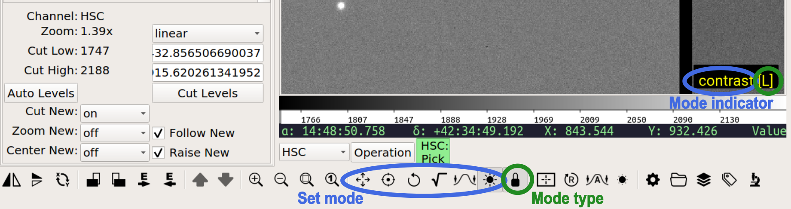

.. _ch-modes:

+++++
Modes
+++++

As discussed in the Concepts section on :ref:`concepts-modes`,
modes are a mechanism that allow Ginga to accommodate many key and
pointer bindings for a large number of possible operations.  
Modes are associated with the basic Ginga viewer widget and so can be
used even with the widget standalone in your own programs (i.e., apart
from the Reference Viewer; see :ref:`ch-programming-ginga` for details).

Invoking Modes
==============
Modes are used to make bindings between keyboard, mouse, trackpad and
gesture events and certain operations on the viewer widget.
By invoking a mode, certain keystrokes and cursor bindings are enabled
for certain operations within the viewer window in which the mode was
entered.  Typically, pressing the space key with the widget focus in the
viewer window is used to enter the special "Meta" mode, in which you can
then enter any one of the registered modes by following up pressing its
mode activation key.

Only one mode (or no mode) can be active at a time in a particular
viewer widget.  Once a mode is activated, the *mode indicator* should
turn on in one of the corners of the viewer window to indicate which
mode is active: 

To exit a mode, press the Esc (escape) key.

.. note::
   In the Reference Viewer, you can also enter and exit certain modes
   using the "Toolbar" plugin (see :ref:`sec-plugins-toolbar`).

Modal vs. Non-modal Operation
=============================
Ginga viewer widgets have a dual modal/non-modal (aka "modeless")
operation.  If no mode is active, then certain operations from a mode
can still be invoked by default bindings that are declared for the
modeless state.
For example, by default, the scroll wheel will normally operate the zoom
operation on the viewer even though that is officially an operation
defined in the "Pan" mode. Furthermore, Ginga canvases can also register
for keystroke and cursor bindings.  The resolution order of handling a
particular keyboard or cursor event is as follows:

1. if the viewer is in a mode, and there is a binding for the event in
   the mode
2. if there is a active canvas that has a binding for the event
3. if there is a binding for the event in the modeless state

At each stage of this event resolution, if the event is not handled by
the event handler (in the previous stage), then the next stage of event
handling is invoked. 

Basically, this boils down to the following practical advice:

* A mode takes precedence; you can always count on the bindings in the
  mode doing what they do, no matter what canvases are active.
* If you are using an active canvas (like many Reference Viewer plugins
  do), you may need to exit out of a mode if bindings for the mode
  interfere (mask) necessary bindings for the canvas.
* If some default modeless binding doesn't seem to be working, it may be
  because an active canvas has registered for that binding. In such a
  case, you can invoke a mode to do the operation and then exit the mode
  to get back to working with the canvas, or close the plugin that has
  installed the active canvas.

Mode Types
==========

The mode switching system has a *mode type* which can be set to one of:

* ``oneshot``: The mode is exited by initiating and finishing a cursor drag,
  or when ``Esc`` is pressed (if no cursor drag is performed)
* ``locked``: The mode is locked until the meta mode key is pressed
  again (or ``Esc``)

By default most modes are activated in "locked" type.

.. note::

   When the lock is active, it is signified by an additional "[L]"
   (locked) appearing in the mode indicator; oneshot mode is
   indicated by "[O]". In the figure above, you can see the mode
   indicator showing that the viewer is in "contrast" mode, with the
   mode type as "Lock". In the Reference Viewer, the same information
   can be seen in the Toolbar plugin, where the lock icon shows
   the state of the mode type (``engaged == 'Lock'``).

==============
Standard Modes
==============
These are the set of modes that come with Ginga.  Those interested in
writing their own custom mode should refer to 
:ref:`ch-dev-modes` in the developers manual.

.. note::

   The standard modes and default bindings are summarized in the
   Quick Reference :ref:`ginga-quick-reference`.  In the reference
   viewer, you can pop up a help tab with the bindings for the mode
   if you press 'h' in the channel viewer while that viewer is in a
   mode.

.. _sec_mode_cmap:

CMap
====
.. automodapi:: ginga.modes.cmap
   :no-heading:
   :skip: CMapMode
     
.. _sec_mode_contrast:

Contrast
========
.. automodapi:: ginga.modes.contrast
   :no-heading:
   :skip: ContrastMode
     
.. _sec_mode_cuts:

Cuts
====
.. automodapi:: ginga.modes.cuts
   :no-heading:
   :skip: CutsMode
     
.. _sec_mode_dist:

Dist
====
.. automodapi:: ginga.modes.dist
   :no-heading:
   :skip: DistMode
     
.. _sec_mode_pan:

Pan
===
.. automodapi:: ginga.modes.pan
   :no-heading:
   :skip: PanMode
     
.. _sec_mode_zoom:

Zoom
====
.. automodapi:: ginga.modes.zoom
   :no-heading:
   :skip: ZoomMode
     
.. _sec_mode_rotate:

Rotate
======
.. automodapi:: ginga.modes.rotate
   :no-heading:
   :skip: RotateMode
     
.. _sec_mode_naxis:

Naxis
=====
.. automodapi:: ginga.modes.naxis
   :no-heading:
   :skip: NaxisMode
     
