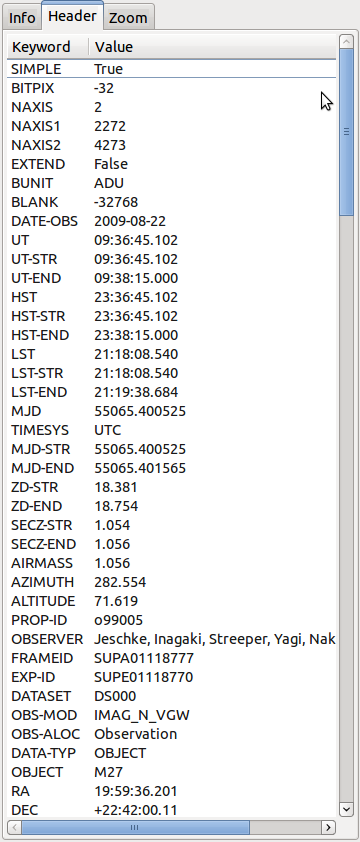
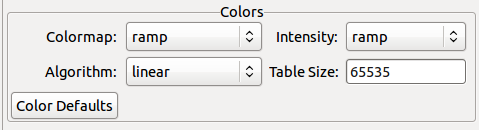
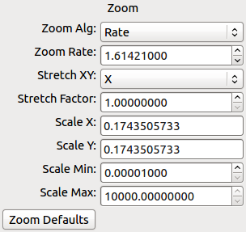
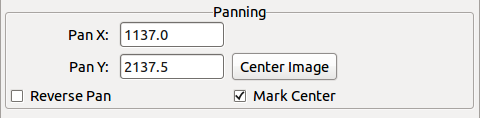
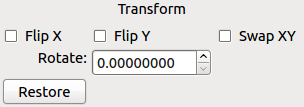
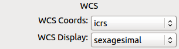
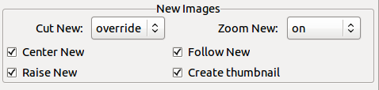
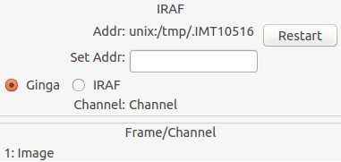

.. _ch-plugins:

+++++++
Plugins
+++++++

Ginga is written so that most of the functionality of the program is
achieved through the use of plugins.  This modular approach allows a
large degree of flexiblity and customization, as well as making overall
design and maintenance of the program simpler.

Plugins are divided into two types: global and local.  A global plugin
has a single instance shared by all channels, while a local plugin
creates a unique instance for each channel.  If you switch channels, a
global plugin will respond to the change by updating itself,
while a local plugin will remain unchanged if the channel is switched,
because its operation is specific to a given channel.

This chapter describes the set of plugins that come with Ginga.  Those
interested in writing their own custom plugins should refer to chapter
:ref:`sec-writingplugins`. 

.. _sec-globalplugins:

==============
Global plugins
==============

.. image:: figures/pan-plugin.png
   :align: center

The Pan plugin provides a small panning image that gives an overall
"birds-eye" view of the channel image that last had the focus.  If the
channel image is zoomed in 2X or greater then the pan region is shown
graphically in the Pan image by a rectangle.  The channel image can be
panned by clicking and/or dragging to place the rectangle.  You can also
use the scroll wheel in the Pan image to zoom the channel image.

The color/intensity map and cut levels of the Pan image are updated
when they are changed in the corresponding channel image.
The Pan image also displays the World Coordinate System compass, if
valid WCS metadata is present in the FITS HDU being viewed in the
channel.

.. _sec-plugin_info:

Info
====

.. image:: figures/info-plugin.png
   :align: center

The Info plugin provides a pane of commonly useful metadata about the
associated channel image.  Common information includes some
FITS header values, the equinox, dimensions of the image, minimum and
maximum values and the zoom level.  As the cursor is moved around the
image, the X, Y, Value, RA and DEC values are updated to reflect the
value under the cursor.

At the bottom of the Info interface are the cut levels controls. Here
the low and high cut levels are shown and can be adjusted.  Finally,
there is a Preferences button that will take the user quickly to the
Preferences plugin for the channel.

The Pan and Info plugins are typically combined under the Info tab in
the user interface.  Below the Info plugin appear several buttons that
can be used to zoom the image or to navigate between images in the
history of the current channel.

.. _sec-plugin_header:

Header
======

The Header plugin shows the FITS keyword metadata from the image.
Initially only the primary HDU metadata is shown.  However, in
conjunction with the MultiDim plugin the metadata for other HDUs will be
shown.  See the MultiDim plugin description for details.

Clicking on a column header will sort the table by values in that
column, which may be useful for quickly locating a particular keyword.

.. _sec-plugin_zoom:

Zoom
====

.. image:: figures/zoom-plugin.png
   :align: center

The Zoom plugin shows an enlarged image of a cutout region centered
under the cursor position in the associated channel image.  As the
cursor is moved around the image the zoom image updates to allow close
inspection of the pixels or precise control in conjunction with other
plugin operations.

The size of the cutout radius can be adjusted by the slider below the
zoom image labeled "Zoom Radius". The default radius is 30 pixels,
making a 61x61 zoom image.  The magnification can be changed by
adjusting the "Zoom Amount" slider.
Above zero, the zoom range corresponds to logical increments: 1=1X,
2=2X, etc.  The zoom scale is discontinuous at the 0 and -1 settings,
which are equivalent to 1X.  Settings below -1 correspond to zooming out,
e.g. -2=1/2, -3=1/3, etc. 

Two modes of operation are possible: absolute and relative zoom.  In
absolute mode, the zoom amount controls exactly the zoom level shown in
the cutout: for example, the channel image may be zoomed into 10X, but
the zoom image will only show a 3X image if the zoom amount is set to
3X.
In relative mode, the zoom amount setting is interpreted as relative to
the zoom setting of the channel image.  If the zoom amount is set to 3X
and the channel image is zoomed to 10X then the zoom image shown will be
10+3=13X.  Note that the zoom amount setting can be negative, so a
setting of -3X with a 10X zoom in the channel image will produce a
10-3=7X zoom image.
In both modes the minimum and maximum zoom level of the zoom image is
limited by the Min Zoom and Max Zoom settings, which are
user-adjustable.  

.. _sec-plugin_thumbs:

Thumbs
======

.. image:: figures/thumbs-plugin.png
   :align: center

The Thumbs plugin provides an index of all images viewed since the
program was started.  Clicking on a thumbnail navigates you directly to
that image.  Thumbs appear in cronological viewing history, with the
newest images at the bottom and the oldest at the top.  Hovering the
cursor over a thumbnail will show a tooltip that contains a couple of
useful pieces of metadata from the image.

.. _sec-plugin_contents:

Contents
========

The Contents plugin provides a table of contents like interface for all
the images viewed since the program was started.  Unlike Thumbs,
Contents is sorted by channel, and then by image name.  The contents
also shows some common metadata from the image.

.. _sec-localplugins:

=============
Local plugins
=============

An *operation* is the activation of a local plugin to perform some
function.  Operations can the started and controlled in two ways:
graphically, or using the keyboard shortcuts.  The plugin manager
toolbar at the bottom of the center pane is the graphical way to start
an operation.  

.. _sec-plugin_pick:

Pick
====

TBD

.. _sec-plugin_header:

Ruler
=====

TBD

MultiDim
========

TBD

Cuts
====

TBD

Histogram
=========

TBD

PixTable
========

TBD

.. _sec-preferences:

Preferences
===========

The Preferences plugin sets the preferences on a per-channel basis.
The preferences for a given channel are inherited from the "Image"
channel until they are explicitly set and saved using this plugin.

Color Preferences
-----------------

The Colors preferences controls the preferences used for the color map,
intensity map, color mapping algorithm and color hash table size.
Together these control the mapping of data values into a 24-bpp RGB
visual representation.

The "Colormap" control selects which color map should be loaded and
used.  Click the control to show the list, or simply scroll the mouse
wheel while hovering the cursor over the control.

The "Intensity" control selects which intensity map should be used
with the color map.  The intensity map is applied just before the color
map, and can be used to change the standard linear scale of values into
an inverted scale, logarithmic, etc.

The "Algorithm" control is used to set the initial mapping of pixel
values into a hash table.

The "Table Size" control sets the size of the hash table used to map
pixel values.

Ginga comes with a good selection of color maps, but should you want
more you can add custom ones or, if matplotlib is installed, you
can load all the ones that it has installed.  
See :ref:`ch-customization` for details.

Zoom Preferences
----------------

The Zoom preferences control Ginga's zooming/scaling behavior.

Ginga supports two zoom algorithms, chosen using the "Zoom Alg" control:

* The *step* algorithm zooms the image inwards in discrete
  steps of 1X, 2X, 3X, etc. or outwards in steps of 1/2X, 1/3X, 1/4X,
  etc.  This algorithm results in the least artifacts visually, but is a
  bit slower to zoom over wide ranges when using a scrolling motion
  because more "throw" is required to achieve a large zoom change
  (this is not the case if one uses of the shortcut zoom keys, such as
  the digit keys). 

* The *rate* algorithm zooms the image by advancing the scaling at
  a rate defined by the value in the Zoom Rate box.  This rate defaults
  to the square root of 2.  Larger numbers cause larger changes in scale
  between zoom levels.  If you like to zoom your images rapidly, at a
  small cost in image quality, you would likely want to choose this
  option. 

Note that regardless of which method is chosen for the zoom algorithm,
the zoom can be controlled by holding down Ctrl (coarse) or Shift
(fine) while scrolling to constrain the zoom rate.

The "Stretch XY" control can be used to stretch one of the axes (X or
Y) relative to the other.  Select an axis with this control and roll the
scroll wheel while hovering over the "Stretch Factor" control to
stretch the pixels in the selected axis.

The "Scale X" and "Scale Y" controls offer direct access to the
underlying scaling, bypassing the discrete zoom steps.  Here exact
values can be typed to scale the image.  Conversely, you will see these
values change as the image is zoomed.

The "Scale Min" and "Scale Max" controls can be used to place a
limit on how much the image can be scaled.

The "Zoom Defaults" button will restore the controls to the Ginga
default values. 

Pan Preferences
---------------

The Pan preferences control Ginga's panning behavior.

The "Pan X" and "Pan Y" controls offer direct access to set the pan
position in the image (the part of the image located at the center of
the window)--you can see them change as you pan around the image.

The "Center Image" button sets the pan position to the center of the
image, as calculated by halving the dimensions in X and Y.

Checking the "Reverse Pan" box reverses the sense of zooming and
panning in Ginga: the scroll wheel will zoom the image in the opposite
direction of normal, and when free panning you move to the opposite
corner of the window to pan to the corner that you want to see.  
This control is largely for the benefit of those used to the scrolling
and zooming behavior of some older FITS viewers.

The "Mark Center" check box, when checked, will cause Ginga to draw a
small reticle in the center of the image.  This is useful for knowing
the pan position and for debugging.

Transform Preferences
---------------------

The Transform preferences provide for transforming the view of the image
by flipping the view in X or Y, swapping the X and Y axes, or rotating
the image in arbitrary amounts. 

The "Flip X" and "Flip Y" checkboxes cause the image view to be
flipped in the corresponding axis.

The "Swap XY" checkbox causes the image view to be altered by swapping
the X and Y axes.  This can be combined with Flip X and Flip Y to rotate
the image in 90 degree increments.  These views will render more quickly
than arbitrary rotations using the Rotate control. 

The "Rotate" control will rotate the image view an arbitrary amount.
The value should be specified in degrees.  Rotate can be specified in
conjunction with flipping and swapping.

The "Restore" button will restore the view to the default view, which
is unflipped, unswapped and unrotated.

Auto Cuts Preferences
---------------------

.. image:: figures/autocuts-prefs.png
   :align: center

The Auto Cuts preferences control the calculation of auto cut levels for
the view when the auto cut levels button or key is pressed, or when
loading a new image with auto cuts enabled. 

The "Auto Method" control is used to choose which auto cuts algorithm
used: "minmax" (minimum maximum values), "histogram" (based on an image
histogram), "stddev" (based on the standard deviation of pixel values), or 
"zscale" (based on the ZSCALE algorithm popularized by IRAF).

WCS Preferences
---------------

The WCS preferences control the display preferences for the World
Coordinate System calculations used to report the cursor position in the
image. 

The "WCS Coords" control is used to select the coordinate system in
which to display the result.

The "WCS Display" control is used to select a sexagesimal (H:M:S)
readout or a decimal degrees readout.

New Image Preferences
---------------------

The New Images preferences determine how Ginga reacts when a new image
is loaded into the channel.  This includes when an older image is
revisited by clicking on its thumbnail in the Thumbs plugin pane.

The "Cut New" setting controls whether an automatic cut levels
calculation should be performed on the new image, or whether the
currently set cut levels should be applied.  The possible settings are:

* on: calculate a new cut levels always;

* override: calculate a new cut levels until the user overrides
  it by manually setting a cut levels, then turn `off'; or

* off: always use the currently set cut levels.

The *override* setting is provided for the convenience of having an
automatic cut levels, while preventing a manually set cuts from being
overrided when a new image is ingested.  When typed in the image window, 
the semicolon key can be used to toggle the mode back to override (from
"off"), while colon will set the preference to *on*.  The global plugin
Info panel shows the state of this setting.

The "Zoom New" setting controls whether a newly visited image should
be zoomed to fit the window.  There are three possible values: on,
override, and off:

* on: the new image is always zoomed to fit;

* override: images are automatically fitted until the zoom level is
  changed manually--then the mode automatically changes to `off', or

* off: always use the currently set zoom levels.

The *override* setting is provided for the convenience of having an
automatic zoom, while preventing a manually set zoom level from being
overrided when a new image is ingested.  When typed in the image window, 
the apostrophe (aka "single quote") key can be used to toggle the mode
back to override (from "off"), while quote (aka double quote) will set
the preference to *on*.  The global plugin Info panel shows the state of
this setting. 

The "Center New" box, if checked, will cause newly visited images to
always have the pan position reset to the center of the image.  If
unchecked, the pan position is unchanged from the previous image.

The "Follow New" setting is used to control whether Ginga will change
the display if a new image is loaded into the channel.  If unchecked,
the image is loaded (as seen, for example, by its appearance in the
Thumbs tab), but the display will not change to the new image.  This
setting is useful in cases where new images are being loaded by some
automated means into a channel and the user wishes to study the current
image without being interrupted.

The "Raise New" setting controls whether Ginga will raise the tab of a
channel when an image is loaded into that channel.  If unchecked then
Ginga will not raise the tab when an image is loaded into that
particular channel.

The "Create Thumbnail" setting controls whether Ginga will create a
thumbnail for images loaded into that channel.  In cases where many
images are being loaded into a channel frequently (e.g. a low frequency
video feed) it may be undesirable to create thumbnails for all of them.

Catalog
-------

TBD

Drawing
-------

TBD

FBrowser
--------

TBD

WBrowser
--------

TBD

Optional Plugins
================

There are a number of plugins distributed with Ginga that are not loaded
by default.  In keeping with the "small is beautiful" mantra, these
plugins can be loaded when needed.

Remote Control
--------------

You may find that you have a need to control Ginga remotely.  For
example, you want to invoke the loading of images, or performing
operations on images, etc.  Like many other aspects, Ginga delegates this
task to a plugin: RC.  
Because remote control of Ginga is handled by a plugin, you can easily
change the types of operations that can be done, or completely change
the protocol used.

The remote control module is not loaded by default.  To load it, specify
the command line option::
    --modules=RC

You can then control Ginga from the `grc` program located in the 
`scripts` directory (and installed with ginga).  Some examples:

Create a new channel::
    $ grc ginga add_channel FOO
 
Load a file::
    $ grc ginga load FOO /home/eric/testdata/SPCAM/SUPA01118797.fits

Cut levels::
    $ grc channel FOO cut_levels 163 1300

Auto cut levels::
    $ grc channel FOO auto_levels

Zoom to fit::
    $ grc channel FOO zoom_fit
 
Transform::
    $ grc channel FOO transform 1 0 1

Almost any method on the Ginga shell or a channel can be invoked from
the remote plugin.  Methods on the shell can be called like this::
    $ grc ginga <method> <arg1> <arg2> ...

Channel methods can be called like this::
    $ grc channel <chname> <method> <arg1> <arg2> ...

Built in help is available for showing method docstrings.

Show example usage::
    $ grc help

Show help for a specific ginga method::
    $ grc help ginga <method>

Show help for a specific channel method::
    $ grc help channel <chname> <method>

Calls can be made from a remote host by simply adding the options::
    --host=<hostname> --port=9000

to the command line.

In some cases, you may need to resort to shell escapes to be able to
pass certain characters to Ginga.  For example, a leading dash character is
usually interpreted as a program option.  In order to pass a signed
integer you may need to do something like::
    $ grc -- channel FOO zoom -7

SAMP Control
------------

Ginga includes a plugin for enabling SAMP (Simple Applications Messaging
Protocol) support.  With SAMP support, Ginga can be controlled and
interoperate with other astronomical desktop applications.

The SAMP module is not loaded by default.  To load it, specify
the command line option::
    --modules=SAMP

There is no GUI for this plugin.
Currently, SAMP support is limited to `image.load.fits` messages.

IRAF Interaction
----------------

The IRAF plugin allows Ginga to interoperate with IRAF in a manner
similar to IRAF and ds9.  The following IRAF commands are supported:
`imexamine`, `rimcursor`, `display` and `tvmark`.

To use the IRAF plugin, first make sure the environment variable IMTDEV
is set appropriately, e.g.::
    $ export IMTDEV=inet:45005

or::

    $ export IMTDEV=unix:/tmp/.imtg45

If the environment variable is not set, Ginga will default to that used
by IRAF. 
    
Then start Ginga and IRAF.  For Ginga, the IRAF module is not loaded by
default.  To load it, specify the command line option::
    --modules=IRAF

In Ginga a GUI for the IRAF plugin will appear in the tabs on the right.

It can be more convenient to load images via Ginga than IRAF.  From
Ginga you can load images via drag and drop or via the FBrowser 
plugin and then use `imexamine` from IRAF to do analysis tasks on
them.  You can also use the `display` command from IRAF to show
images already loaded in IRAF in Ginga, and then use `imexamine` to
select areas graphically for analysis.

When using `imexamine` or `rimcursor`, the plugin disables
normal UI processing on the channel image so that keystrokes,
etc. normally caught by Ginga are passed through to IRAF.  You can
toggle back and forth between local Ginga control (e.g. keystrokes to
zoom and pan the image, or apply cut levels, etc.) and IRAF control
using the radio buttons at the top of the tab.   

IRAF deals with images in enumerated "frames", whereas Ginga uses
named channels.  The bottom of the IRAF plugin GUI will show the mapping
from Ginga channels to IRAF frames.

