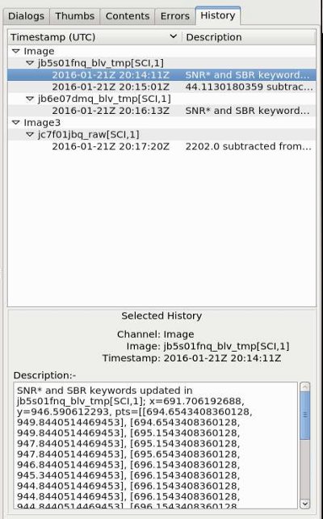

.. _sec-plugins-changehistory:

ChangeHistory
=============

This global plugin is used to log any changes to data buffer. For example,
a change log would appear here if a new image is added to a mosaic via the
Mosaic plugin. Like :ref:`sec-plugins-contents`, the log is sorted by channel,
and then by image name.

.. automodule:: ginga.misc.plugins.ChangeHistory
