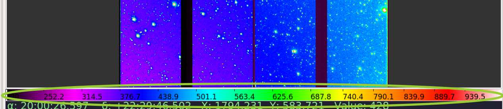

.. _sec-plugins-colorbar:

Colorbar
========

The Colorbar plugin shows a color bar indicating the color map applied
to the image and showing the example values along the range.

Usage
-----
Clicking and dragging in the Colorbar window will shift the colormap
left or right.  Scrolling will stretch or shrink the colormap at the
cursor position.  Right-clicking will restore the colormap from any
shift or stretch.

If the focus shifts to another channel, the colorbar will be updated to
reflect that channel's colormap and value information.

