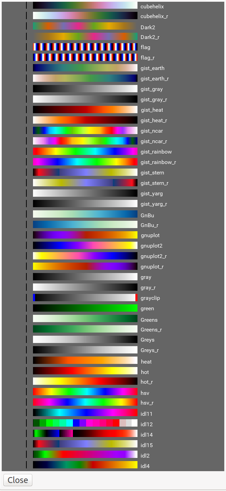

.. _sec-plugins-colormappicker:

ColorMapPicker
==============

The ColorMapPicker plugin is used to graphically browse and select a
color map for a channel image viewer.

Usage
-----
Operation of the plugin is very simple: the color maps are displayed in
the form of color bars and labels in the main view pane of the plugin.
Click on any one of the bars to set the color map of the currently
active channel in the viewer.

You can scroll vertically or use the scroll bars to move through the
color bar samples. 

.. note:: When the plugin starts for the first time, it will generate
          a bitmap RGB image of color bars and labels corresponding to
          all the available color maps.  This can take a few seconds
          depending on the number of color maps installed.

