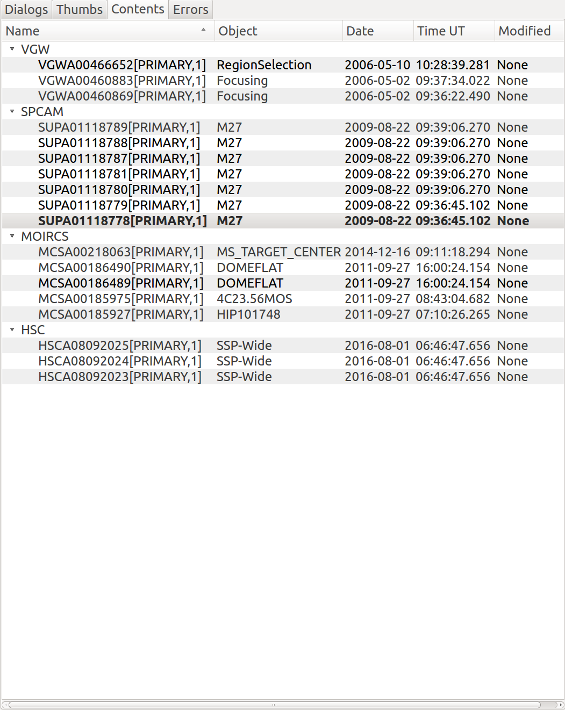

.. _sec-plugins-contents:

Contents
========

The Contents plugin provides a table of contents like interface for all
the images viewed since the program was started.  Unlike Thumbs,
Contents is sorted by channel.  The contents also shows some configurable
metadata from the image.

Usage
-----
Double-click on a column heading to sort the table by that column's
value.  The image in the currently focused channel will normally be
highlighted.  You can click on any image to force that image to be shown
in the associated channel.

.. note:: The columns and their values are drawn from the FITS header.
          This can be customized by setting the "columns" parameter in
          the "plugin_Contents.cfg" settings file.

