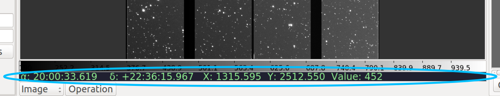

.. _sec-plugins-cursor:

Cursor
======

The Cursor plugin displays a summary line of text that changes as the
user moves the cursor around an image.  In the standard reference viewer
configuration, it appears as a line containing green text just below the
Colorbar plugin.

Cursor is a global plugin and there is no associated configuration GUI.

Usage
-----
Cursor simply tracks the cursor as it moves around an image and displays
information about the pixel coordinates, WCS coordinates (if available)
and the value of the pixel under the cursor.

.. note:: Pixel coordinates are affected by the general setting
          "pixel_coords_offset" which can be set in the "general.cfg"
          configuration file for ginga.  The default is value for this
          setting is 1.0, which means pixel coordinates are reported
          from an origin of 1, as per the FITS standard.

        
