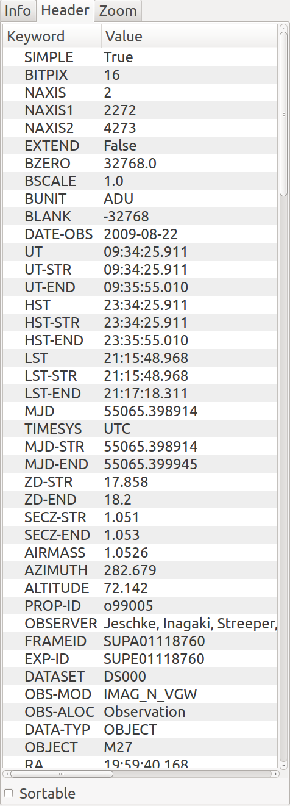

.. _sec-plugins-header:

Header
======

The Header plugin shows the FITS keyword metadata from the image.
Initially only the primary HDU metadata is shown.  However, in
conjunction with the MultiDim plugin the metadata for other HDUs will be
shown.  See :ref:`sec-plugins-multidim` for details.

If the "Sortable" checkbox has been checked in the lower left of the UI,
then clicking on a column header will sort the table by values in that
column, which may be useful for quickly locating a particular keyword.
