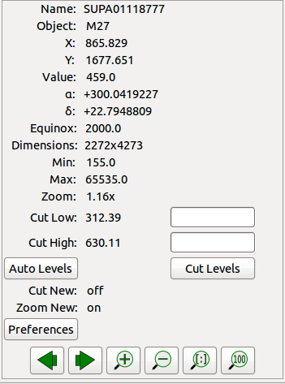

.. _sec-plugins-info:

Info
====

The Info plugin provides a pane of commonly useful metadata about the
associated channel image.  Common information includes some
FITS header values, the equinox, dimensions of the image, minimum and
maximum values and the zoom level.  As the cursor is moved around the
image, the X, Y, Value, RA and DEC values are updated to reflect the
value under the cursor.

At the bottom of the Info interface are the cut levels controls. Here
the low and high cut levels are shown and can be adjusted.  Finally,
there is a Preferences button that will take the user quickly to the
Preferences plugin for the channel.

The Pan and Info plugins are typically combined under the Info tab in
the user interface.  Below the Info plugin appear several buttons that
can be used to zoom the image or to navigate between images in the
history of the current channel.
