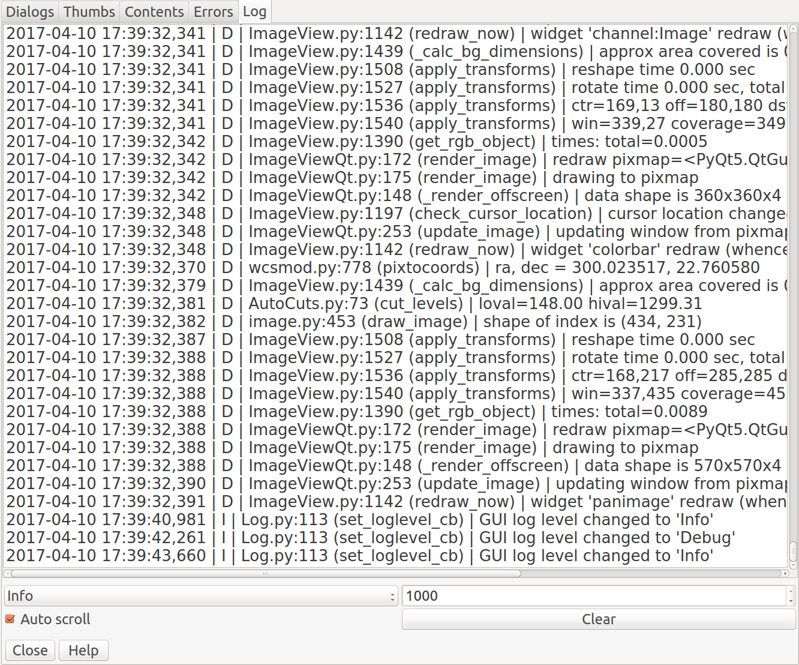

.. _sec-plugins-log:

Log
===
See the logging output of the reference viewer.

           
Usage
-----
The Log plugin builds a UI that includes a large, scrolling text widget
showing the active output of the logger.  The latest output shows up at
the bottom.  This can be useful for troubleshooting problems.

There are four controls:

* The combo box on the lower left allows you to choose the level of
  logging desired.  The four levels, in order of verbosity are: "debug",
  "info", "warn" and "error".
* The box with the number on the lower right allows you to set how many
  lines of input to keep in the display buffer (e.g. keep only the last
  1000 lines).
* The checkbox "Auto scroll", if checked, will cause the large text
  widget to scroll to the end as new log messages are added.  Uncheck
  this if you want to peruse the older messages and study them.
* The "Clear" button is used to clear the text widget, so that only new
  logging shows up.

