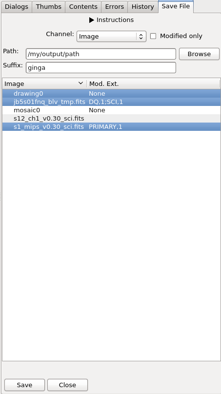

.. _sec-plugins-global-saveimage:

SaveImage (Save File)
=====================

.. note::

  This plugin uses :ref:`Astropy FITS <astropy:astropy-io-fits>` to
  write the output images, regardless of what is chosen for
  ``FITSpkg`` in your ``~/.ginga/general.cfg`` configuration file.

This global plugin is used to save any changes made in Ginga back to output
images. For example, a mosaic image that was created by
:ref:`sec-plugins-mosaic`. Currently, only FITS images (single or
multiple extensions) are supported.

Given the output directory (e.g., ``/mypath/outputs/``), a suffix
(e.g., ``ginga``), an image channel (``Image``), and a selected image
(e.g., ``image1.fits``), the output file will be
``/mypath/outputs/image1_ginga_Image.fits``. Inclusion of the channel name is
optional and can be omitted using plugin configuration file (see below).
The modified extension(s)
will have new header or data extracted from Ginga, while those not modified will
remain untouched. Relevant change log entries from
:ref:`sec-plugins-changehistory` global plugin will be inserted into the
history of its ``PRIMARY`` header.

.. automodule:: ginga.misc.plugins.SaveImage
