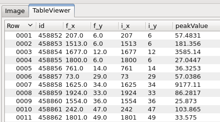

.. _sec-plugins-tableviewer:

TableViewer
===========

This global plugin is used to display table data. It is automatically started
when a FITS image extension containing table data is selected from
:ref:`sec-plugins-multidim`. It uses :ref:`astropy:astropy-table` to read in
the FITS table.

.. automodule:: ginga.misc.plugins.TableViewer
