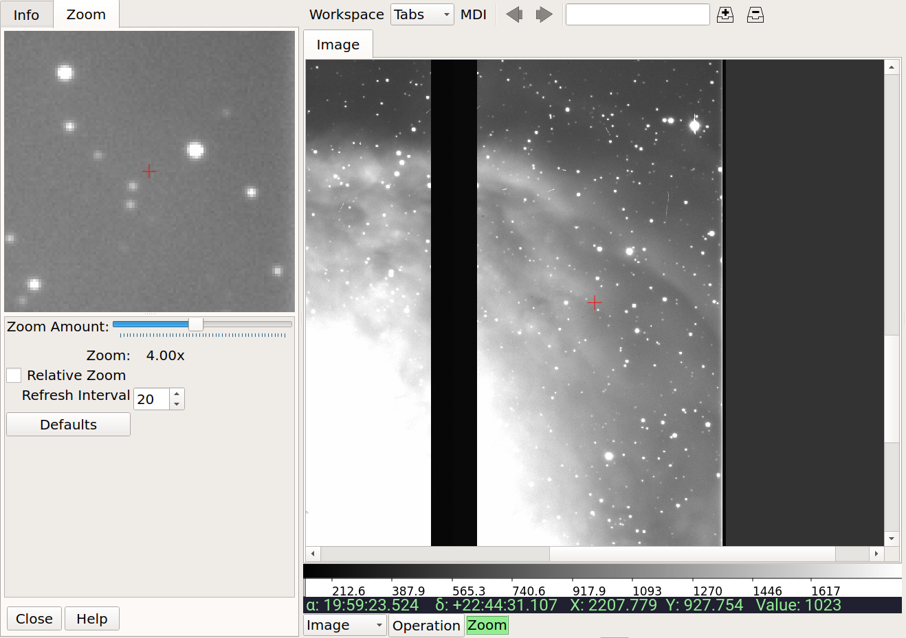

.. _sec-plugins-zoom:

Zoom
====

The Zoom plugin shows an enlarged image of a cutout region centered
under the cursor position in the associated channel image.  As the
cursor is moved around the image the zoom image updates to allow close
inspection of the pixels or precise control in conjunction with other
plugin operations.

The size of the cutout radius can be adjusted by the slider below the
zoom image labeled "Zoom Radius". The default radius is 30 pixels,
making a 61x61 zoom image.  The magnification can be changed by
adjusting the "Zoom Amount" slider.
Above zero, the zoom range corresponds to logical increments: 1=1X,
2=2X, etc.  The zoom scale is discontinuous at the 0 and -1 settings,
which are equivalent to 1X.  Settings below -1 correspond to zooming out,
e.g. -2=1/2, -3=1/3, etc.

Two modes of operation are possible: absolute and relative zoom.  In
absolute mode, the zoom amount controls exactly the zoom level shown in
the cutout: for example, the channel image may be zoomed into 10X, but
the zoom image will only show a 3X image if the zoom amount is set to
3X.
In relative mode, the zoom amount setting is interpreted as relative to
the zoom setting of the channel image.  If the zoom amount is set to 3X
and the channel image is zoomed to 10X then the zoom image shown will be
10+3=13X.  Note that the zoom amount setting can be negative, so a
setting of -3X with a 10X zoom in the channel image will produce a
10-3=7X zoom image.

The `Lag Time` setting controls how quickly the Zoom plugin responds to
the movement of the cursor in updating the zoom image.  The value is
specified in milliseconds.

.. tip:: Usually setting a small lag time *improves* the overall
	 responsiveness of the Zoom image, and the default value of 2 is
	 a reasonable one.  You can experiment with the value if the zoom
	 image seems too jerky or out of sync with the mouse movement in
	 the channel image window.
