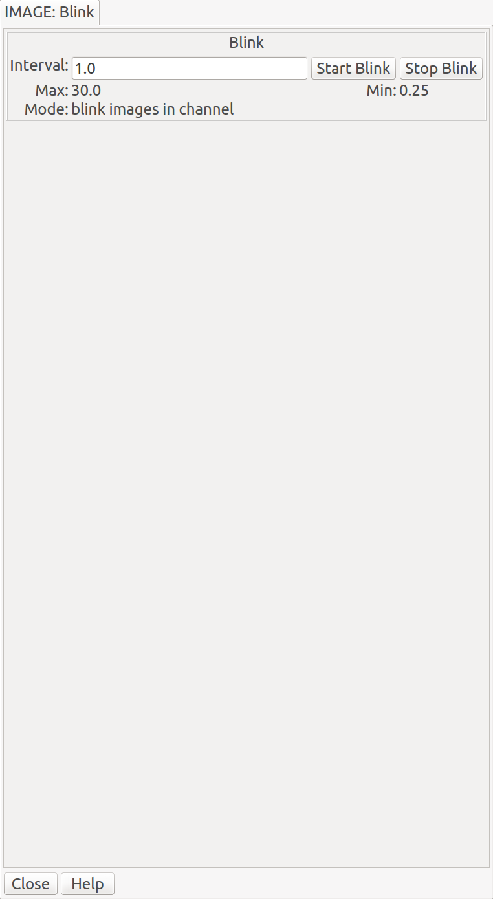

.. _sec-plugins-blink:

Blink
=====

Blink switches through the images shown in a channel at a rate chosen by
the user.  Alternatively, it can switch between channels in the main
workspace.  In both cases, the primary purpose is to compare and
contrast the images (within a channel, or across channels) visually
within a short timescale--like blinking your eyes.

.. note:: Blink can be invoked either as a local plugin, in which case
          it cycles through the images in the channel, or as a global
          plugin, in which case it cycles through the channels.

.. note:: Local plugins are started from the "Operations" button, while
          global plugins are started from the "Plugins" menu.

Usage
-----
Set the interval between image changes in terms of seconds in
the box labeled "Interval".  Finally, press "Start Blink" to start the
timed cycling, and "Stop Blink" to stop the cycling.

You can change the number in "Interval" and press Enter to
dynamically change the cycle time while the cycle is running.
