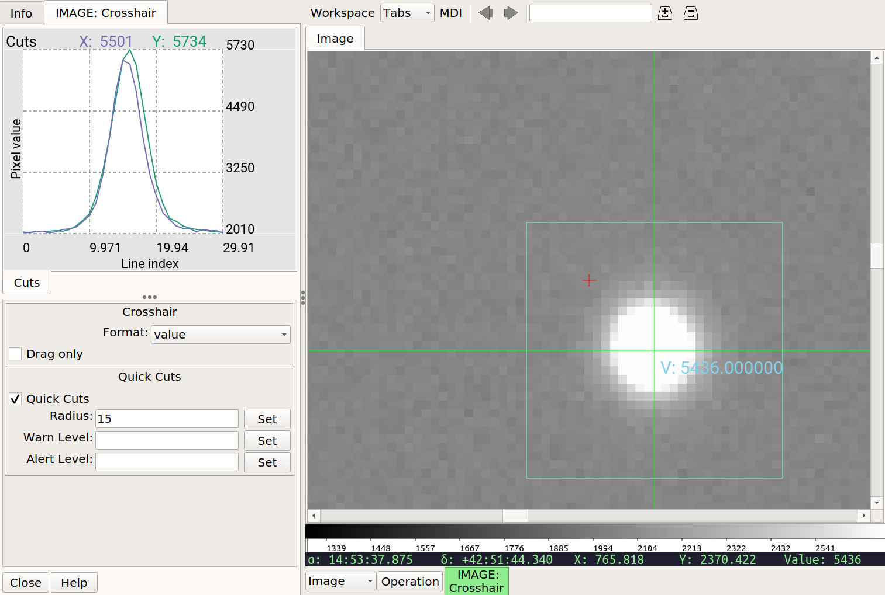

.. _sec-plugins-crosshair:

Crosshair
=========

Crosshair is a simple plugin to draw crosshairs labeled with the
position of the cross in pixel coordinates, WCS coordinates or data
value at the cross position.

.. note:: Crosshair is a local plugin, and thus must be invoked
          separately for each channel in which you want to use it.

Usage
-----
Select the appropriate type of output in the "Format" drop-down
box in the UI: "xy" for pixel coordinates, "coords" for the WCS
coordinates, and "value" for the value at the crosshair position.

Then click and drag to position the crosshair.
