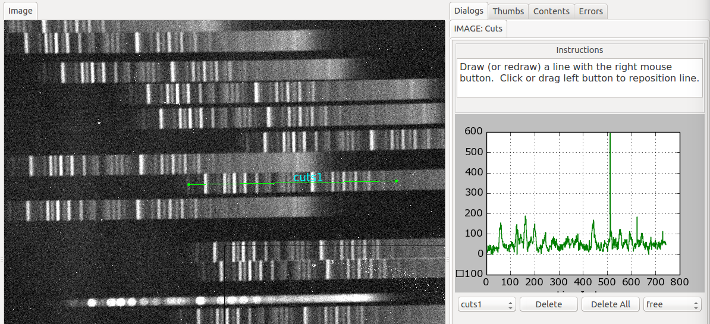

.. _sec-plugins-cuts:

Cuts
====

Cuts plots a simple graph of pixel values vs. index for a line drawn
through the image.

This plugin can plot several cuts together.  As long as a cut is
selected in the drop down box underneath the graph, any newly drawn line
will replace that cut by a new one.  To *add* a new cut, simply select
"New Cut" from the  drop down box and draw the new cut.  To change this
behaviour, copy the file `plugin_Cuts.cfg` from `ginga/examples/configs`
to `~/.ginga`. Open it and set `select_new_cut` to `True`. This will
make the plugin create a new cut for any newly drawn line. Use the `Delete`
button to delete the currently selected cut and `Delete All` to delete
all cuts. To move or edit a cut, select the cut from the drop down box and
select `Move` or `Edit`. Use the `Save` button to save the cuts plot as
as image and data as a Numpy compressed archive.

There are several keyboard shortcuts that are available when this plugin
is active.  Press 'h' to place a full width horizontal cut underneath
the cursor position and 'v' to place a full height vertical cut.

If a new image is added to the channel while the plugin is active it
will update with the new calculated cuts on the new image.

If the `enable_slit` setting is set to True this plugin will also enable
slit image functionality (for multidimensional images) via a "Slit" tab.
In the tab UI, select one axes from the "Axes" list and draw a
line. This will create a 2D image that assumes the first two axes are
spatial and index the data along the selected axis.

Much like Cuts, you can view the other slit images using the cut
selection drop down box.
