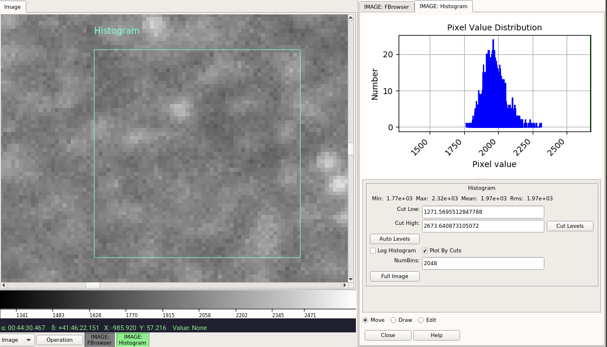

.. _sec-plugins-histogram:

Histogram
=========

Histogram plots a histogram for a region drawn in the image, or for the
entire image.

.. note:: Histogram is a local plugin, and thus must be invoked
          separately for each channel in which you want to use it.  If a
          new image is selected for the channel the histogram plot will
          be recalculated based on the current parameters with the new
          data.

Usage
-----
Click and drag to define a region within the image that will be used to
calculate the histogram.  To take the histogram of the full image, click
the button in the UI labeled "Full Image" (NOTE: depending on the size
of the image calculating the full histogram can take time).

UI Controls
-----------
Three radio buttons at the bottom of the UI are used to control the
effects of the click/drag action:

* select "Move" to drag the region to a different location
* select "Draw" to draw a new region
* select "Edit" to edit the region

To make a log plot of the histogram, check the "Log Histogram" checkbox.
To plot by the full range of values in the image instead of by the range
within the cut values, uncheck the "Plot By Cuts" checkbox.

The "NumBins" parameter determines how many bins are used in calculating
the histogram.  Type a number in the box and press Enter to change the
default value.

Cut Levels Convenience Controls
-------------------------------
Because a histogram is useful feedback for setting the cut levels,
controls are provided in the UI for setting the low and high cut levels
in the image, as well as for performing an auto cut levels, according to
the auto cut levels settings in the channel preferences.

