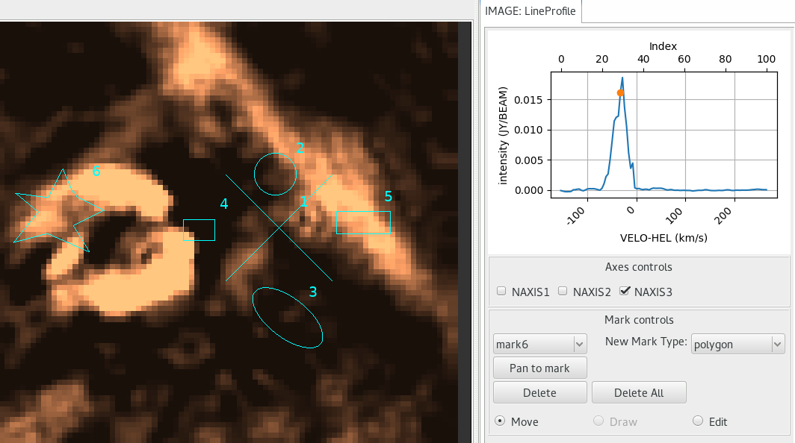

.. _sec-plugins-lineprofile:

Line Profile
============

The Line Profile plugin is used for multidimensional (i.e. 3D or higher)
images.  It plots the values of the pixels at the current cursor
position through the selected axis.  This can be used to create
normal spectral line profiles.  Be warned, there are no restrictions to
what axes can be chosen.  As such, the output can be meaningless.
