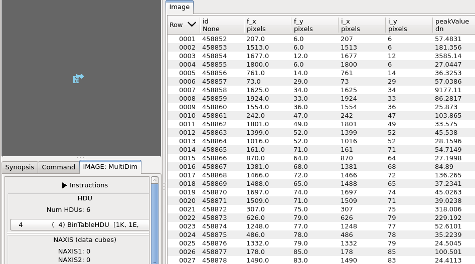

.. _sec-plugins-multidim:

MultiDim
========

.. image:: figures/multidim-plugin.png
   :align: center
   :width: 600px
   :alt: MultDim image display

MultiDim is a plugin designed to handle data cubes and multi-HDU FITS
files. If you have opened such an image in Ginga, starting this plugin
will enable you to browse to other slices of the cube or view other
HDUs.

For a data cube, you can save a slice as an image using the **Save Slice**
button or create a movie using the **Save Movie** button by entering the
"Start" and "End" slice indices. This feature requires 'mencoder' to be
installed.

For a FITS table, its data are read in using
:ref:`astropy.table <astropy:astropy-table>`.
Column units are displayed right under the main header ("None" if no unit).
For masked columns, masked values are replaced with pre-defined fill values.

.. automodule:: ginga.rv.plugins.MultiDim
