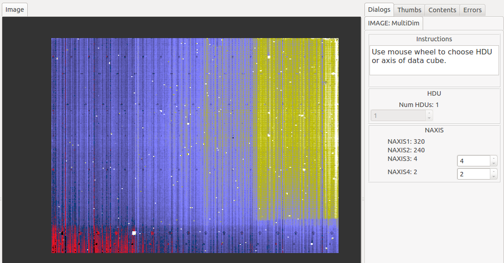

.. _sec-plugins-multidim:

MultiDim
========

MultiDim is a plugin designed to handle data cubes and multi-HDU FITS
files.  If you have opened such an image in Ginga, starting this plugin
will enable you to browse to other slices of the cube or view other
HDUs.  You can save a slice as an image using the `Save Slice` button
or create a movie using the `Save Movie` button by entering the "Start"
and "End" slice indices.  This feature requires 'mencoder' to be installed.
Note that currently there is no support for tables in Ginga,
so at present only image data can be displayed.
