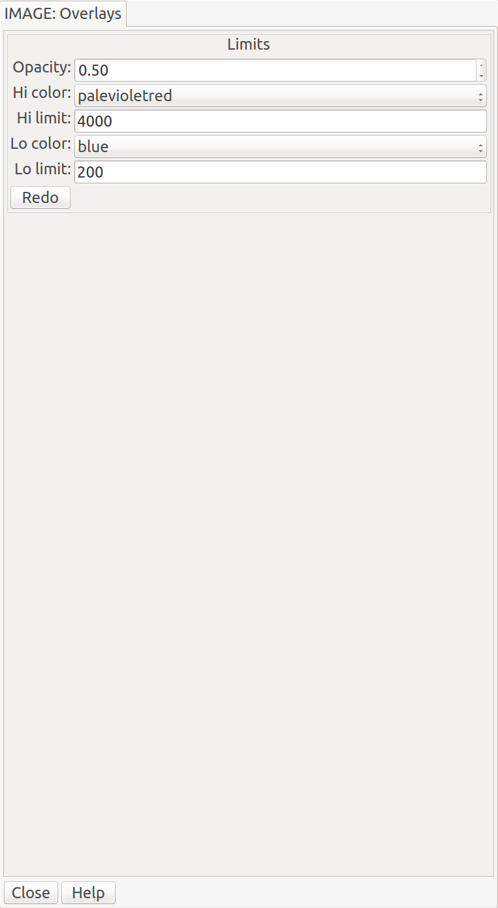

.. _sec-plugins-overlays:

Overlays
========

A plugin for generating color overlays representing under- and
over-exposure in the loaded image.

.. note:: Overlays is a local plugin, and thus must be invoked
          separately for each channel in which you want to use it.  If a
          new image is selected for the channel the overlays will
          be recalculated based on the current parameters with the new
          data.

Usage
-----
Choose colors from the drop-down menus for the low limit and/or
high-limit ("Lo color" and "Hi color").  Specify the limits for low and
high values in the limit boxes ("Lo limit" and "Hi limit").  Set the
opacity of the overlays with a value between 0 and 1 in the "Opacity"
box.  Finally, press the "Redo" button.

The color overlay should show areas below the low limit with a low color
and the areas above the high limit in the high color.

If you omit a limit (leave the box blank), that color won't be shown in
the overlay.

