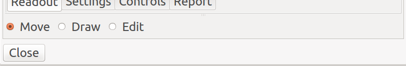
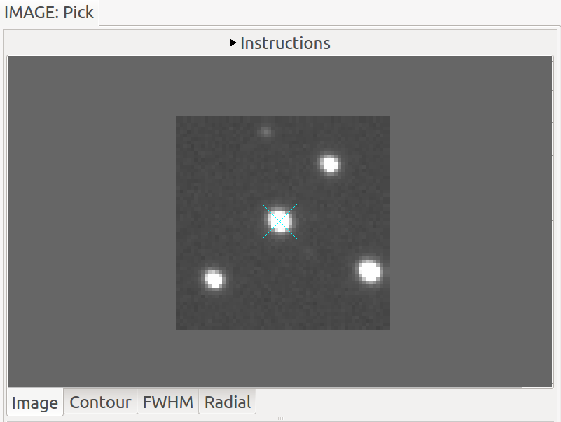
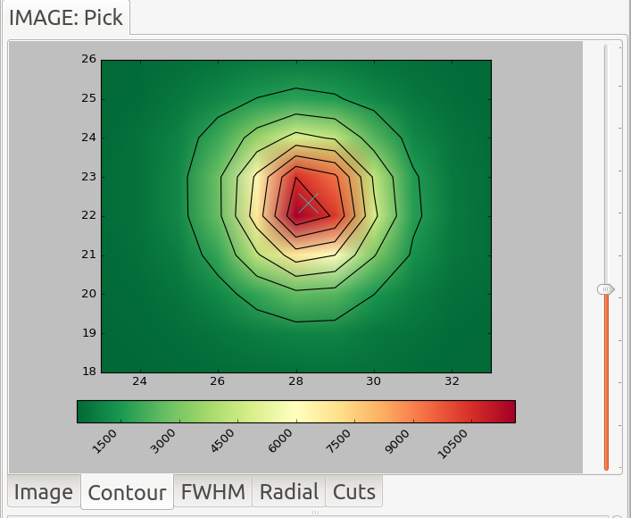
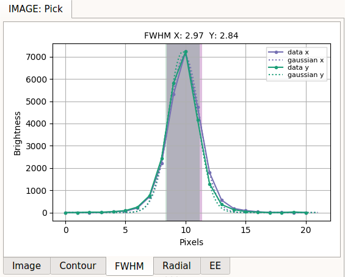
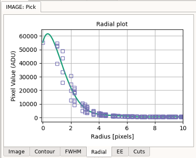
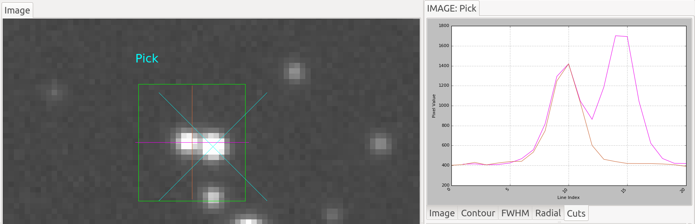
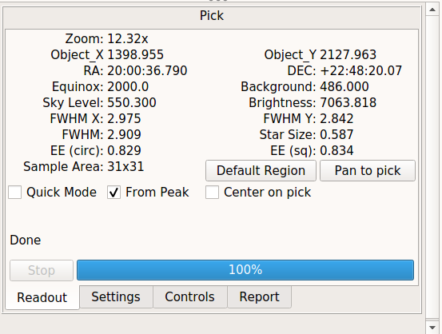
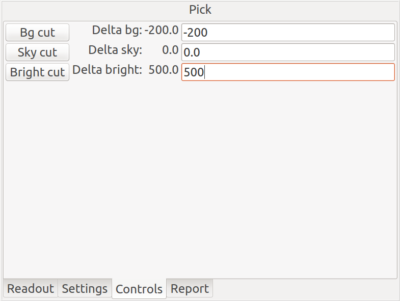
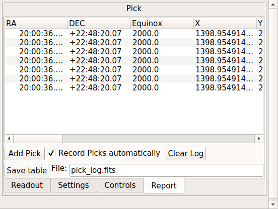

.. _sec-plugins-pick:

Pick
====

.. image:: figures/pick-sc1.png
   :width: 800px
   :align: center
   :alt: Pick plugin

.. automodapi:: ginga.rv.plugins.Pick
   :no-heading:
   :skip: Pick

.. image:: figures/pick-no-candidate.png
   :width: 800px
   :align: center
   :alt: Marker when no candidate found

.. image:: figures/pick-contour-no-candidate.png
   :width: 400px
   :align: center
   :alt: Contour when no candidate found

.. image:: figures/pick-settings.png
   :width: 400px
   :align: center
   :alt: Settings tab of Pick plugin

.. image:: figures/pick-candidates.png
   :width: 800px
   :align: center
   :alt: The channel viewer when "Show candidates" is checked.
