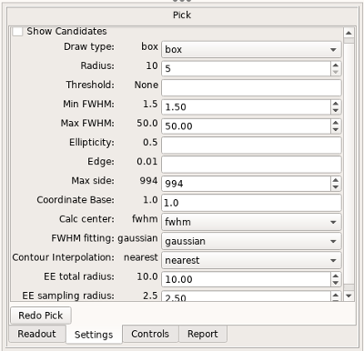
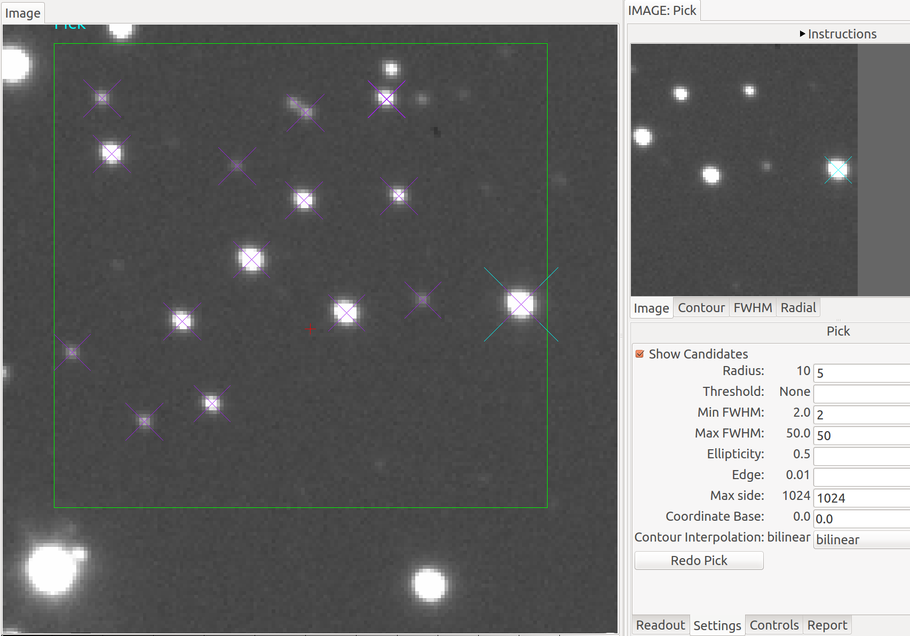

.. _sec-plugins-pick:

Pick
====

Perform astronomical stellar quick analysis.

.. image:: figures/pick-sc1.png
   :width: 800px
   :align: center

The Pick plugin is used to perform quick astronomical data quality analysis
on stellar objects.  It locates stellar candidates within a drawn rectangle,
and picks the most likely candidate based on a set of search settings.
The Full Width Half Max (FWHM) is reported on the candidate object, as
well as its size based on the plate scale of the detector.  Rough
measurement of background, sky level and brightness is done.

Usage
-----

Defining the pick area
^^^^^^^^^^^^^^^^^^^^^^

The default pick area is defined as a rectangle of approximately 30x30
pixels that encloses the search area.

The move/draw/edit selector at the bottom of the plugin is used to
determine what operation is being done to the pick area:

  .. image:: figures/pick-move-draw-edit.png
     :width: 400px
     :align: center

* If "move" is selected then you can move the existing pick area by
  dragging it or clicking where you want the center of it placed.
  If there is no existing area a default one will be created.
* If "draw" is selected then you can draw a shape with the cursor
  to enclose and define a new pick area.  The default shape is a
  rectangle, but other shapes can be selected in the "Settings" tab.
* If "edit" is selected, then you can edit the pick area by dragging its
  control points, or moving it by dragging in the bounding box.

After the area is moved, drawn or edited, it will perform a search on
the area based on the criteria in the "Settings" tab of the UI
(see "The Settings Tab", below) and try to locate a candidate.

If a candidate is found
^^^^^^^^^^^^^^^^^^^^^^^

The candidate will be marked with a `Point` (usually an "X") in the
channel viewer canvas, centered on the object as determined by the
horizontal and vertical FWHM measurements.

The top set of tabs in the UI will be populated as follows.
The "Image" tag will show the contents of the cutout area:

  .. image:: figures/pick-cutout.png
     :width: 400px
     :align: center

The widget in this tab is a Ginga widget and so can be zoomed and panned
with the usual keyboard and mouse bindings (e.g. scroll wheel).  It will
also be marked with a `Point` centered on the object and additionally the
pan position will be set to the found center.

The "Contour" tab will show a contour plot:

  .. image:: figures/pick-contour.png
     :width: 400px
     :align: center

This is a contour plot of the area immediately surrounding the
candidate, and not usually encompassing the entire region of the pick
area.  You can use the vertical slider to the right of the plot to
increase or decrease the area of the contour plot.

The "FWHM" tab will show a FWHM plot:

  .. image:: figures/pick-fwhm.png
     :width: 400px
     :align: center

The blue lines show measurements in the X direction and the green lines
show measurements in the Y direction.  The solid lines indicate actual
pixel values and the dotted lines indicate the fitted 1D gaussians.
The shaded green and blue regions indicate the FWHM measurements.
(Moffat fitting is also available.)

The "Radial" tab contains a radial profile plot:

  .. image:: figures/pick-radial.png
     :width: 400px
     :align: center

Plotted points in blue are data values, and a line is fitted to the
data.

The "Readout" tab will be populated with a summary of the measurements:

  .. image:: figures/pick-readout.png
     :width: 400px
     :align: center

There are two buttons in this tab:

* The "Pan to pick" button will pan the channel viewer to the
  located center.
* The "Default Region" button restores the pick region to the default
  shape and size.

The "Controls" tab has a couple of buttons that will work off of the
measurements:

  .. image:: figures/pick-controls.png
     :width: 400px
     :align: center

* The "Bg cut" button will set the low cut level of the channel viewer
  to the measured background level.  A delta to this value can be
  applied by setting a value in the "Delta bg" box (press Enter to
  change the setting).
* The "Sky cut" button will set the low cut level of the channel viewer
  to the measured sky level.  A delta to this value can be
  applied by setting a value in the "Delta sky" box (press Enter to
  change the setting).
* The "Bright cut" button will set the high cut level of the channel viewer
  to the measured sky+brightness levels.  A delta to this value can be
  applied by setting a value in the "Delta bright" box (press Enter to
  change the setting).

The "Report" tab is used to record information about the measurements in
tabular form:

  .. image:: figures/pick-report.png
     :width: 400px
     :align: center

By pressing the "Add Pick" button the information about the most recent
candidate is added to the table.  If the "Record Picks automatically"
checkbox is checked, then any candidates are added to the table
automatically.

.. note:: If the "Show candidates" checkbox in the "Settings" tab is
          checked, then *all* objects found in the region (according to
          the Settings) will be added to the table instead of just the
          selected candidate.

You can clear the table at any time by pressing the "Clear Log" button.
The log can be saved to a table by putting a valid path and
filename in the "File:" box and pressing "Save table". File type is
automatically determined by the given extension
(e.g., ".fits" is FITS and ".txt" is plain text), as accepted by
:ref:`Astropy unified file read/write interface <astropy:table_io>`.

If no candidate is found
^^^^^^^^^^^^^^^^^^^^^^^^

If no candidate can be found (based on the Settings) then the pick area
is marked with a red `Point` centered on the pick area:

  .. image:: figures/pick-no-candidate.png
     :width: 800px
     :align: center

The image cutout will be taken from this central area and so the "Image"
tab will still have content.  It will also be marked with a central red
"X" as shown.

The contour plot will still be produced from the cutout:

  .. image:: figures/pick-contour-no-candidate.png
     :width: 400px
     :align: center

But all the other plots will be cleared.

The Settings Tab
----------------

The "Settings" tab controls aspects of the search within the pick area:

* The "Show candidates" checkbox controls whether all detected sources
  are marked or not (as shown in the figure below).  Additionally, if
  checked then all the found objects are added to the pick log table
  when using the Report controls.
* The "Draw type" parameter is used to choose the shape of the pick area
  to be drawn.
* The "Radius" parameter sets the radius to be used when finding and
  evaluating bright peaks in the image.
* The "Threshold" parameter is used to set a threshold for peak finding;
  if set to None then a reasonable default value will be chosen.
* The "Min FWHM" and "Max FWHM" parameters can be used to eliminate
  certain sized objects from being candidates.
* The "Ellipticity" parameter is used to eliminate candidates based on
  their asymmetry in shape.
* The "Edge" parameter is used to eliminate candidates based on how
  close to the edge of the cutout they are.  **NOTE: currently this
  works reliably only for non-rotated rectangular shapes.**
* The "Max side" parameter is used to limit the size of the bounding box
  that can be used in the pick shape.  Larger sizes take longer to
  evaluate.
* The "Coordinate Base" parameter is an offset to apply to located
  sources.  Set to "1" if you want sources pixel locations reported
  in a FITS-compliant manner and "0" if you prefer 0-based indexing.
* The "Calc center" parameter is used to determine whether the center
  is calculated from FWHM fitting ("fwhm") or centroiding ("centroid").
* The "FWHM fitting" parameter is used to determine which function is
  is used for FWHM fitting ("gaussian" or "moffat").
* The "Contour Interpolation" parameter is used to set the interpolation
  method used in rendering the background image in the "Contour" plot.

The "Redo Pick" button will redo the search operation.  It's convenient
if you have changed some parameters and want to see the effect based on the
current pick area without disturbing it.

