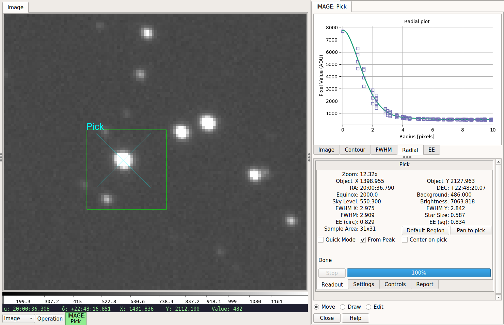
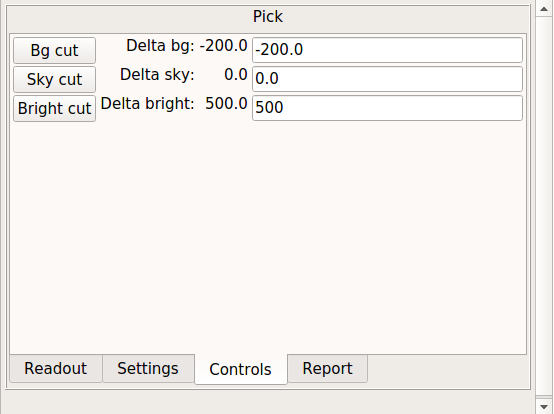

.. _sec-plugins-pick:

Pick
====

.. automodapi:: ginga.rv.plugins.Pick
   :no-heading:
   :skip: Pick

**Figures to show specific plugin usage**

.. figure:: figures/pick-move-draw-edit.png
   :width: 400px
   :align: center
   :alt: Move, Draw and Edit buttons

   "Move", "Draw", and "Edit" buttons.

.. figure:: figures/pick-cutout.png
   :width: 400px
   :align: center
   :alt: Image tab of Pick area

   "Image" tab of ``Pick`` area.

.. figure:: figures/pick-contour.png
   :width: 400px
   :align: center
   :alt: Contour tab of Pick area

   "Contour" tab of ``Pick`` area.

   "FWHM" tab of ``Pick`` area.

.. figure:: figures/pick-radial.png
   :width: 400px
   :align: center
   :alt: Radial tab of Pick area

   "Radial" tab of ``Pick`` area.

.. figure:: figures/pick-cuts.png
   :width: 800px
   :align: center
   :alt: Cut tab of Pick area

   "Cut" tab of ``Pick`` area.

   "Readout" tab of ``Pick`` area.

   "Controls" tab of ``Pick`` area.

.. figure:: figures/pick-report.png
   :width: 400px
   :align: center
   :alt: Report tab of Pick area

   "Report" tab of ``Pick`` area.

.. figure:: figures/pick-no-candidate.png
   :width: 800px
   :align: center
   :alt: Marker when no candidate found

   Marker when no candidate found.

.. figure:: figures/pick-contour-no-candidate.png
   :width: 400px
   :align: center
   :alt: Contour when no candidate found.

   Contour when no candidate found.

.. figure:: figures/pick-settings.png
   :width: 400px
   :align: center
   :alt: Settings tab of Pick plugin

   "Settings" tab of ``Pick`` plugin.

.. figure:: figures/pick-candidates.png
   :width: 800px
   :align: center
   :alt: The channel viewer when "Show candidates" is checked.

   The channel viewer when "Show candidates" is checked.
