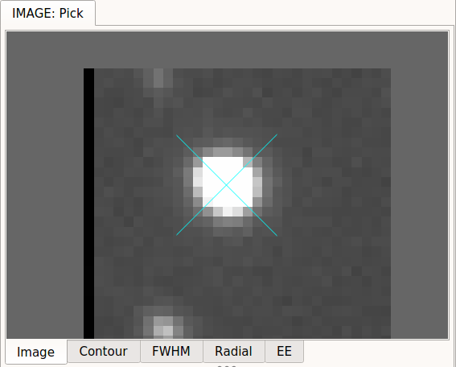
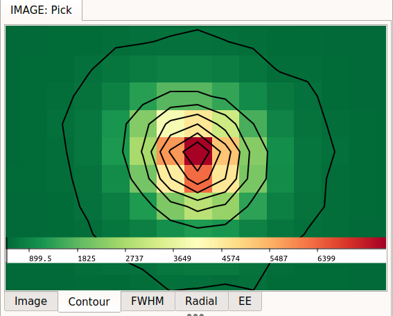
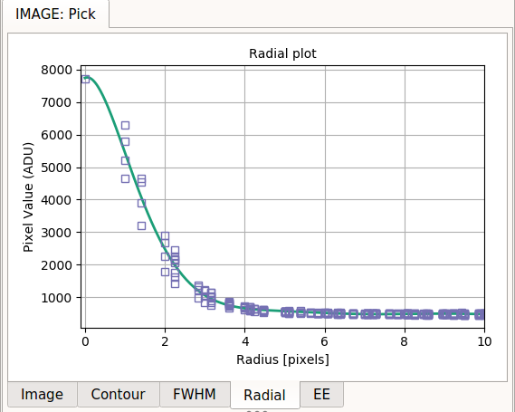
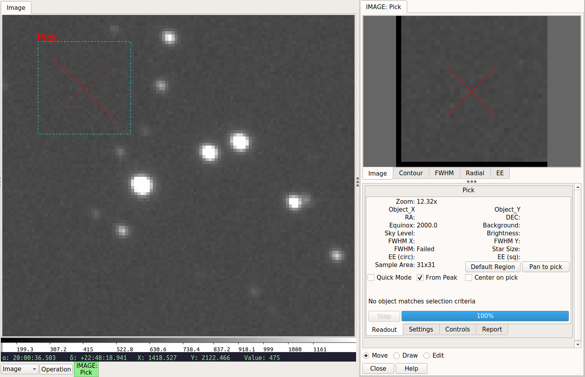
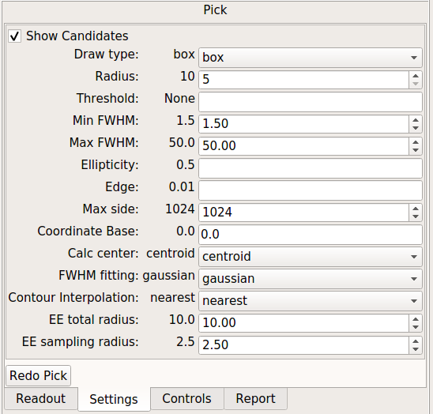
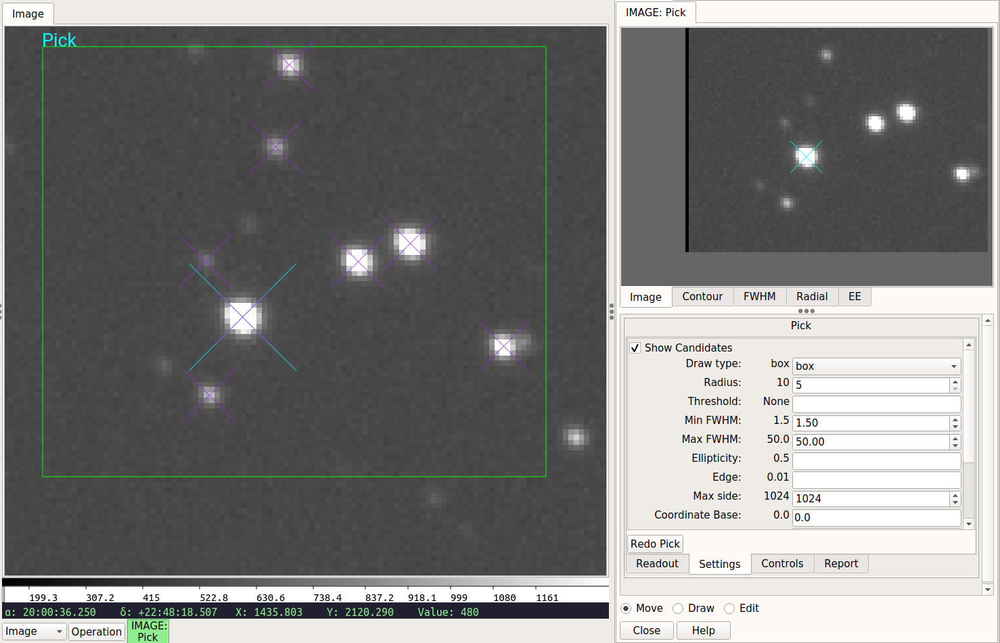

.. _sec-plugins-pick:

Pick
====

.. image:: figures/pick-sc1.png
   :width: 800px
   :align: center
   :alt: Pick plugin

.. automodapi:: ginga.rv.plugins.Pick
   :no-heading:
   :skip: Pick

.. image:: figures/pick-move-draw-edit.png
   :width: 400px
   :align: center
   :alt: Defining a Pick area

.. image:: figures/pick-fwhm.png
   :width: 400px
   :align: center
   :alt: FWHM tab of Pick area

.. image:: figures/pick-cuts.png
   :width: 800px
   :align: center
   :alt: Cut tab of Pick area

.. image:: figures/pick-readout.png
   :width: 400px
   :align: center
   :alt: Readout tab of Pick area

.. image:: figures/pick-controls.png
   :width: 400px
   :align: center
   :alt: Controls tab of Pick area

.. image:: figures/pick-contour-no-candidate.png
   :width: 400px
   :align: center
   :alt: Contour when no candidate found

