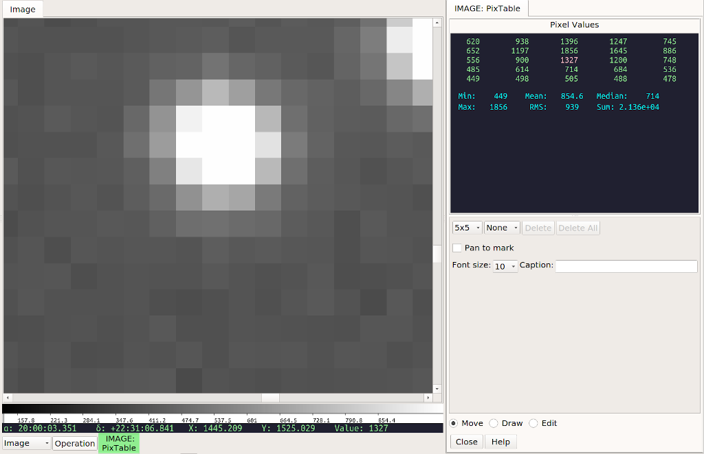

.. _sec-plugins-pixtable:

PixTable
========

PixTable provides a way to check or monitor the pixel values in
a region.

Basic Use
---------
In the most basic use, simply move the cursor around the channel
viewer; an array of pixel values will appear in the "Pixel Values"
display in the plugin UI.  The center value is highlighted, and this
corresponds to the value under the cursor.

You can choose a 3x3, 5x5, 7x7 or 9x9 grid from the leftmost
combobox control.  It may help to adjust the "Font Size" control
to prevent having the array values cut off on the sides.  You can
also enlarge the plugin workspace to see more of the table.

.. note:: the order of the value table shown will not necessarily
          match to the channel viewer if the images is flipped,
          transposed or rotated. 

Using Marks
-----------
If you click in the channel viewer, it will set a mark.  There can
be any number of marks, and they are each noted with an "X"
annotated with a number.  When that mark is selected it will only
show the values around the mark.  Simply change the mark control to
select a different mark to see the values around it.

The marks will stay in position even if a new image is loaded and
they will show the values for the new image.  In this way you can
monitor the area around a spot if the image is updating frequently.

If the "Pan to mark" checkbox is selected, then when you select a
different mark from the mark control, the channel viewer will pan to
that mark.  This can be useful to inspect the same spots in several
different images.

.. note:: if you change the mark control back to "None" then the pixel
          table will again update as you move the cursor around the
          viewer.

Deleting Marks
--------------
To delete a mark, select it in the mark control and then press the
button marked "Delete".  To delete all the marks, press the button
marked "Delete All".
