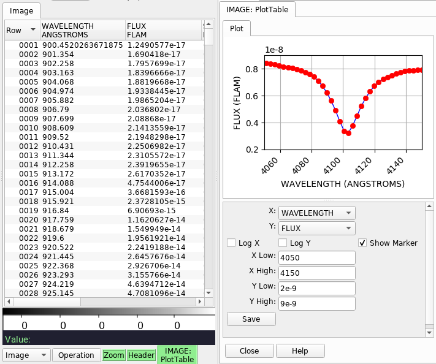

.. _sec-plugins-plottable:

PlotTable
=========

PlotTable is a plugin designed to plot any two selected columns for a given
FITS table HDU (can be accessed via :ref:`sec-plugins-multidim`).
For masked columns, masked data is not shown (even if only one of the
``(X, Y)`` pair is masked).
It is meant as a way to quickly look at table data and not for detailed
scientific analysis.

.. automodule:: ginga.rv.plugins.PlotTable
