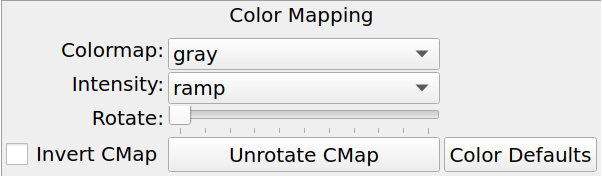

.. _sec-plugins-preferences:

Preferences
===========

The Preferences plugin sets the preferences on a per-channel basis.
The preferences for a given channel are inherited from the "Image"
channel until they are explicitly set and saved using this plugin.

.. _preferences_color_distribution:

Color Distribution Preferences
------------------------------

The Color Distribution preferences controls the preferences used for the
data value to color index conversion that occurs after cut levels are
applied and just before final color mapping is performed.  It concerns
how the values between the low and high cut levels are distributed to
the color and intensity mapping phase.

The `Algorithm` control is used to set the algorithm used for the
mapping.  Click the control to show the list, or simply scroll the mouse
wheel while hovering the cursor over the control.  There are eight
algorithms available: linear, log, power, sqrt, squared, asinh, sinh,
and histeq.  The name of each algorithm is indicative of how
the data is mapped to the colors in the color map.  `linear` is the
default.

.. _preferences_color_mapping:

Color Mapping Preferences
-------------------------

The Color Mapping preferences controls the preferences used for the
color map and intensity map, used during the final phase of the color
mapping process. Together with the Color Distribution preferences, these
control the mapping of data values into a 24-bpp RGB visual representation.

The `Colormap` control selects which color map should be loaded and
used.  Click the control to show the list, or simply scroll the mouse
wheel while hovering the cursor over the control.

The `Intensity` control selects which intensity map should be used
with the color map.  The intensity map is applied just before the color
map, and can be used to change the standard linear scale of values into
an inverted scale, logarithmic, etc.

Ginga comes with a good selection of color maps, but should you want
more you can add custom ones or, if matplotlib is installed, you
can load all the ones that it has installed.
See :ref:`ch-customization` for details.

.. _preferences_zoom:

Zoom Preferences
----------------

The Zoom preferences control Ginga's zooming/scaling behavior.

Ginga supports two zoom algorithms, chosen using the `Zoom Alg` control:

* The *step* algorithm zooms the image inwards in discrete
  steps of 1X, 2X, 3X, etc. or outwards in steps of 1/2X, 1/3X, 1/4X,
  etc.  This algorithm results in the least artifacts visually, but is a
  bit slower to zoom over wide ranges when using a scrolling motion
  because more `throw` is required to achieve a large zoom change
  (this is not the case if one uses of the shortcut zoom keys, such as
  the digit keys).

* The *rate* algorithm zooms the image by advancing the scaling at
  a rate defined by the value in the Zoom Rate box.  This rate defaults
  to the square root of 2.  Larger numbers cause larger changes in scale
  between zoom levels.  If you like to zoom your images rapidly, at a
  small cost in image quality, you would likely want to choose this
  option.

Note that regardless of which method is chosen for the zoom algorithm,
the zoom can be controlled by holding down Ctrl (coarse) or Shift
(fine) while scrolling to constrain the zoom rate (assuming the default
mouse bindings).

The `Stretch XY` control can be used to stretch one of the axes (X or
Y) relative to the other.  Select an axis with this control and roll the
scroll wheel while hovering over the `Stretch Factor` control to
stretch the pixels in the selected axis.

The `Scale X` and `Scale Y` controls offer direct access to the
underlying scaling, bypassing the discrete zoom steps.  Here exact
values can be typed to scale the image.  Conversely, you will see these
values change as the image is zoomed.

The `Scale Min` and `Scale Max` controls can be used to place a
limit on how much the image can be scaled.

The `Zoom Defaults` button will restore the controls to the Ginga
default values.

.. _preferences_pan:

Pan Preferences
---------------

.. image:: figures/pan-prefs.png
   :align: center

The Pan preferences control Ginga's panning behavior.

The `Pan X` and `Pan Y` controls offer direct access to set the pan
position in the image (the part of the image located at the center of
the window)--you can see them change as you pan around the image.

The `Center Image` button sets the pan position to the center of the
image, as calculated by halving the dimensions in X and Y.

The `Mark Center` check box, when checked, will cause Ginga to draw a
small reticle in the center of the image.  This is useful for knowing
the pan position and for debugging.

.. _preferences_transform:

Transform Preferences
---------------------

The Transform preferences provide for transforming the view of the image
by flipping the view in X or Y, swapping the X and Y axes, or rotating
the image in arbitrary amounts.

The `Flip X` and `Flip Y` checkboxes cause the image view to be
flipped in the corresponding axis.

The `Swap XY` checkbox causes the image view to be altered by swapping
the X and Y axes.  This can be combined with Flip X and Flip Y to rotate
the image in 90 degree increments.  These views will render more quickly
than arbitrary rotations using the Rotate control.

The `Rotate` control will rotate the image view the specified amount.
The value should be specified in degrees.  Rotate can be specified in
conjunction with flipping and swapping.

The `Restore` button will restore the view to the default view, which
is unflipped, unswapped and unrotated.

.. _preferences_autocuts:

Auto Cuts Preferences
---------------------

.. image:: figures/autocuts-prefs.png
   :align: center

The Auto Cuts preferences control the calculation of auto cut levels for
the view when the auto cut levels button or key is pressed, or when
loading a new image with auto cuts enabled.

The `Auto Method` control is used to choose which auto cuts algorithm
used: "minmax" (minimum maximum values), "histogram" (based on an image
histogram), "stddev" (based on the standard deviation of pixel values), or
"zscale" (based on the ZSCALE algorithm popularized by IRAF).
As the algorithm is changed, the boxes under it may also change to
allow changes to parameters particular to each algorithm.

.. _preferences_wcs:

WCS Preferences
---------------

The WCS preferences control the display preferences for the World
Coordinate System calculations used to report the cursor position in the
image.

The `WCS Coords` control is used to select the coordinate system in
which to display the result.

The `WCS Display` control is used to select a sexagesimal (H:M:S)
readout or a decimal degrees readout.

.. _preferences_newimages:

New Image Preferences
---------------------

The New Images preferences determine how Ginga reacts when a new image
is loaded into the channel.  This includes when an older image is
revisited by clicking on its thumbnail in the Thumbs plugin pane.

The `Cut New` setting controls whether an automatic cut levels
calculation should be performed on the new image, or whether the
currently set cut levels should be applied.  The possible settings are:

* on: calculate a new cut levels always;
* override: calculate a new cut levels until the user overrides
  it by manually setting a cut levels, then turn "off"; or
* off: always use the currently set cut levels.

.. tip:: The *override* setting is provided for the convenience of
	 having an automatic cut levels, while preventing a manually set
	 cuts from being overridden when a new image is ingested.  When
	 typed in the image window, the semicolon key can be used to
	 toggle the mode back to override (from "off"), while colon will
	 set the preference to *on*.  The global plugin Info panel shows
	 the state of this setting.

The `Zoom New` setting controls whether a newly visited image should
be zoomed to fit the window.  There are three possible values: on,
override, and off:

* on: the new image is always zoomed to fit;
* override: images are automatically fitted until the zoom level is
  changed manually--then the mode automatically changes to "off", or
* off: always use the currently set zoom levels.

.. tip:: The *override* setting is provided for the convenience of
	 having an automatic zoom, while preventing a manually set zoom
	 level from being overridden when a new image is ingested.  When
	 typed in the image window,  the apostrophe (aka "single quote")
	 key can be used to toggle the mode back to override (from
	 "off"), while quote (aka double quote) will set the preference
	 to "on".  The global plugin Info panel shows the state of this
	 setting.

The `Center New` box, if checked, will cause newly visited images to
always have the pan position reset to the center of the image.  If
unchecked, the pan position is unchanged from the previous image.

The `Follow New` setting is used to control whether Ginga will change
the display if a new image is loaded into the channel.  If unchecked,
the image is loaded (as seen, for example, by its appearance in the
Thumbs tab), but the display will not change to the new image.  This
setting is useful in cases where new images are being loaded by some
automated means into a channel and the user wishes to study the current
image without being interrupted.

The `Raise New` setting controls whether Ginga will raise the tab of a
channel when an image is loaded into that channel.  If unchecked then
Ginga will not raise the tab when an image is loaded into that
particular channel.

The `Create Thumbnail` setting controls whether Ginga will create a
thumbnail for images loaded into that channel.  In cases where many
images are being loaded into a channel frequently (e.g. a low frequency
video feed) it may be undesirable to create thumbnails for all of them.
