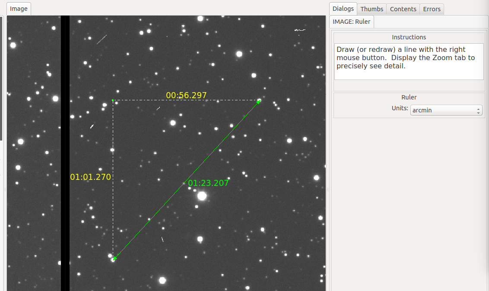

.. _sec-plugins-ruler:

Ruler
=====

Ruler is a simple plugin designed to measure distances on an image.  It
does this by calculating a spherical triangulation via WCS mapping of
three points defined by a single line drawn on the image.  By default,
the distance is shown in arcminutes of sky, but using the Units control
it can be changed to show pixel distance instead.

When another line is drawn it replaces the first one, and when the
plugin is closed the graphic overlay is removed.  Should you want
"sticky rulers", use the Drawing plugin (and choose "Ruler" as the
drawing type).
