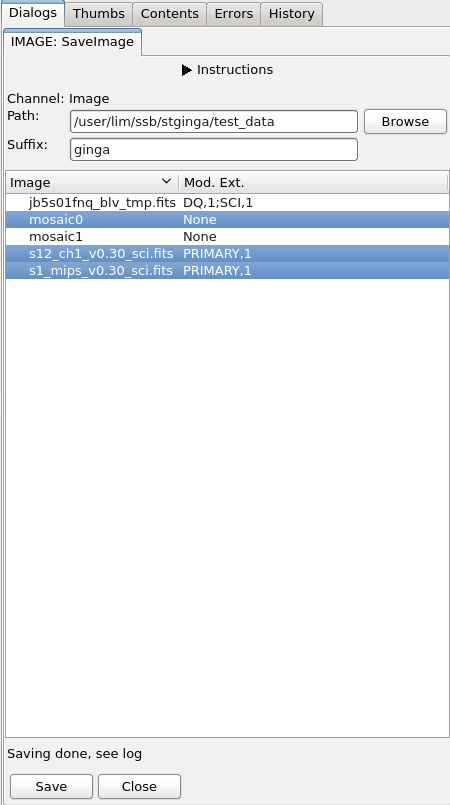

.. _local-plugin-saveimage:

SaveImage
=========

.. note::

  This plugin only works if :ref:`Astropy FITS <astropy:astropy-io-fits>`
  is used. One way to enforce this is to set `FITSpkg='astropy'` in
  your `~/.ginga/general.cfg` configuration file.

This local plugin is used to save any changes made in Ginga back to output
images. For example, a mosaic image that was created by
:ref:`sec-plugins-mosaic`. Currently, only FITS images (single or
multiple extensions) are supported.

Given the output directory (e.g., ``/mypath/outputs/``), a suffix
(e.g., ``ginga``), and a selected image (e.g., ``image1.fits``), the output
file will be ``/mypath/outputs/image1_ginga.fits``. The modified extension(s)
will have new header or data extracted from Ginga, while those not modified will
remain untouched. Relevant change log entries from
:ref:`sec-plugins-changehistory` global plugin will be inserted into the
history of its ``PRIMARY`` header.

.. automodule:: ginga.misc.plugins.SaveImage
