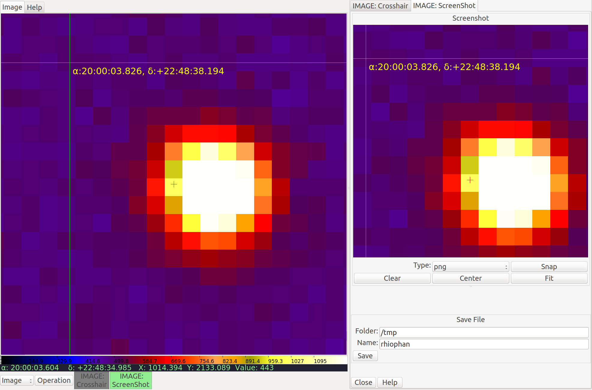

.. _sec-plugins-screenshot:

Screenshot
==========
Capture PNG or JPEG images of the channel viewer image.

Usage
-----
a) Select the RGB graphics type for the snap from the "Type" combo box.
b) Press "Snap" when you have the channel image the way you want to capture it.

A copy of the RGB image will be loaded into the screenshot viewer.
You can pan and zoom within the screenshot viewer like a normal Ginga
viewer to examine detail (e.g. see the magnified difference between
JPEG and PNG formats).

c) Repeat (a) and (b) until you have the image you want.
d) Put a valid path for a new file into the "Folder" box.
e) Put a valid name for a new file into the "Name" box.  There is no need to add file extension; it will be added if needed.
f) Press the "Save" button.  The file will be saved where you specified.

Comments
--------
* PNG offers less artefacts for overlaid graphics, but files are larger than JPE* The "Center" button will center the snap image; "Fit" will set the zoom to it to the window; "Clear" will clear the image.
* Press "1" in the screenshot viewer to zoom to 100% pixels.

