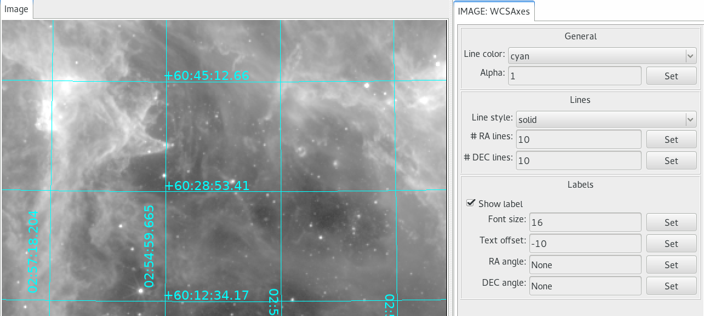

.. _sec-plugins-wcsaxes:

WCSAxes
=======
A plugin for generating WCS axes overlay in the loaded image.

Usage
-----
As long as image as a valid WCS, WCS axes will be displayed.
Use plugin GUI or configuration file to customize axes display.
